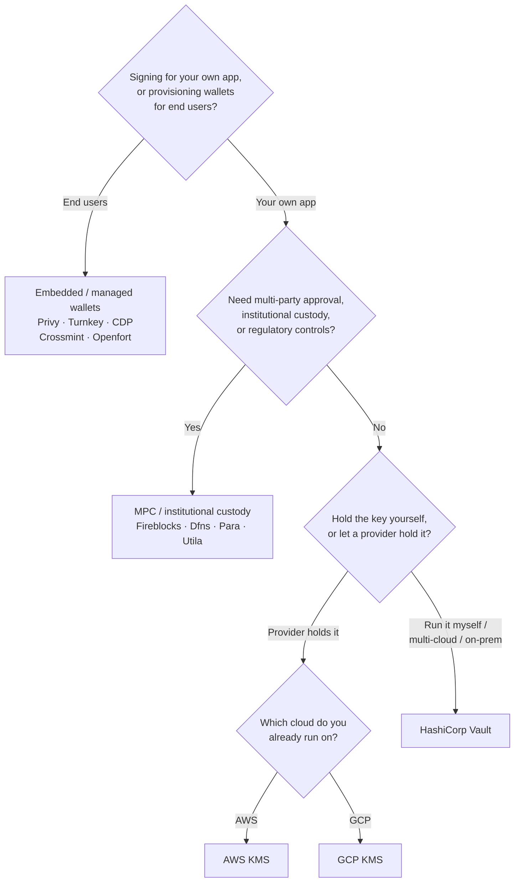

يعرض Keychain واجهة `SolanaSigner` واحدة عبر جميع الواجهات الخلفية، لذا فإن
الاختيار تشغيلي وليس معماريًا — يمكنك تغييره لاحقًا من خلال الإعدادات. لهذا
السبب، **ابدأ من متطلباتك، لا من المنتج.** سؤالان يحسمان معظم الأمر: _أين يوجد
المفتاح الخاص، ومن له صلاحية تفويض التوقيع به؟_

لا توجد واجهة خلفية مثالية واحدة. كل واحدة منها أنسب لمجموعة معينة من القيود —
السحابة التي تعمل عليها بالفعل، وما إذا كنت تريد تشغيل بنية تحتية للمفاتيح، وما
هي ضوابط الحضانة والموافقة المطلوبة منك. يوضح المسار أدناه كيفية تعيين هذه
القيود إلى واجهة خلفية.

<Callout type="info">
  يغطي هذا الدليل التوقيع من جانب الخادم (الواجهة الخلفية). عندما يوقّع مستخدمو
  نهايتك معاملاتهم الخاصة في متصفح، استخدم محفظة عبر معيار Wallet Standard بدلاً
  من ذلك — انظر [التوقيع في
  الإنتاج](/docs/core/transactions/signing-in-production).
</Callout>

## مسار القرار

<Callout type="info">
  لا يحتاج التطوير المحلي والاختبارات إلى أي من هذا — استخدم الواجهة الخلفية
  **Memory** للنماذج الأولية، ثم انتقل إلى إحدى واجهات الإنتاج الخلفية أعلاه عبر
  الإعدادات.
</Callout>

## استعراض الأسئلة

<Steps>

<Step>

### هل تُوقّع لتطبيقك الخاص، أم لمستخدميك النهائيين؟

إذا كنت تُوفّر محافظ يملكها **المستخدمون النهائيون** ويديرونها (تطبيقات
للمستهلكين، وتدفقات الإعداد)، فاستخدم واجهة خلفية لمحفظة **مدمجة / مُدارة** —
Privy أو Turnkey أو CDP أو Crossmint أو Openfort. تدير هذه الخدمات محافظ خاصة
بكل مستخدم والمصادقة نيابةً عنك.

إذا كنت توقّع بصفتك **تطبيقك الخاص** — دافع رسوم، أو خزينة، أو أتمتة خلفية —
تابع القراءة أدناه.

</Step>

<Step>

### هل تحتاج إلى موافقة متعددة الأطراف، أو حضانة مؤسسية، أو ضوابط تنظيمية؟

إذا كانت التوقيعات يجب أن تمرّ عبر سياسة موافقة، أو حد إنفاق، أو سير عمل امتثال
قبل إصدارها — أو كنت بحاجة إلى حارس أصول خاضع للتنظيم يحتفظ بالمفاتيح — فاستخدم
نظام خلفية **MPC / الحضانة المؤسسية**: Fireblocks أو Dfns أو Para أو Utila. تقوم
هذه الأنظمة بتقسيم المفتاح أو حضانته والتوقيع المشترك وفقاً لسياستك.

إذا كنت تحتاج فقط إلى مفتاح يوقّع عند الطلب، تابع القراءة أدناه.

</Step>

<Step>

### هل تريد الاحتفاظ بالمفتاح بنفسك، أم تفضّل أن يحتفظ به مزوّد خارجي؟

إذا كان يجب على مزوّد سحابي الاحتفاظ بالمفتاح في بنية تحتية مدعومة بالأجهزة
وتتحكم سياسة IAM الخاصة بك في صلاحية التوقيع، فاستخدم KMS الخاص بتلك السحابة:

- **التشغيل على AWS** → AWS KMS
- **التشغيل على GCP** → GCP KMS

إذا كنت تريد تشغيل بنية تحتية للمفاتيح بنفسك — أو كنت تعمل في بيئة متعددة السحب
أو محلية — فاستخدم **HashiCorp Vault**. أنت من يُشغّله ويراجعه؛ يظل المفتاح داخل
محرك Transit ويوقّع عند الطلب.

</Step>

</Steps>

## نماذج الحضانة

تُصنَّف الأنظمة الخلفية ضمن خمسة نماذج للحضانة. ينتهي بك المسار أعلاه في أحدها.

- **الحضانة الذاتية (داخل العملية)** — يحتفظ تطبيقك بالمفتاح الخاص الخام. مناسب
  للتطوير، لكنه غير مناسب للإنتاج. النظام الخلفي: **Memory**.
- **إدارة المفاتيح المستضافة ذاتياً** — تُشغّل بنية تحتية للمفاتيح بنفسك؛ يظل
  المفتاح داخلها ويوقّع عند الطلب. النظام الخلفي: **HashiCorp Vault**.
- **KMS السحابي / HSM** — يخزّن مزوّد سحابي المفتاح في بنية تحتية مدعومة
  بالأجهزة؛ لا يغادر المفتاح الخدمة قط وتتحكم سياسة IAM في صلاحية التوقيع.
  الأنظمة الخلفية: **AWS KMS**، **GCP KMS**.
- **MPC والحضانة المؤسسية** — يُقسَّم المفتاح أو تحتضنه جهة مزوّدة تقوم بالتوقيع
  المشترك وفقاً لسياستك (الموافقات والحدود). الأنظمة الخلفية: **Fireblocks**،
  **Dfns**، **Para**، **Utila**.
- **المحافظ المُدمجة والمُدارة** — تدير جهة مزوّدة المحافظ نيابةً عنك، غالباً
  لتأهيل المستخدمين النهائيين. الأنظمة الخلفية: **Privy**، **Turnkey**، **CDP**،
  **Crossmint**، **Openfort**.

## مقارنة الواجهات الخلفية

| الواجهة الخلفية | نموذج الحضانة                | الأنسب لـ                                     | ملاحظات                                                |
| --------------- | ---------------------------- | --------------------------------------------- | ------------------------------------------------------ |
| Memory          | حضانة ذاتية (داخل العملية)   | التطوير المحلي، الاختبارات، CI                | المفتاح الخام داخل العملية — لا تستخدم في بيئة الإنتاج |
| HashiCorp Vault | إدارة مفاتيح ذاتية الاستضافة | الفرق التي تدير بنيتها التحتية للمفاتيح       | محرك Transit؛ أنت من يشغّله ويراجعه                    |
| AWS KMS         | KMS سحابي / HSM              | الواجهات الخلفية العاملة على AWS              | المفتاح لا يغادر KMS أبدًا؛ IAM يتحكم في التوقيع       |
| GCP KMS         | KMS سحابي / HSM              | الواجهات الخلفية العاملة على GCP              | المفتاح لا يغادر KMS أبدًا؛ IAM يتحكم في التوقيع       |
| Fireblocks      | حضانة MPC / مؤسسية           | الخزائن والبورصات والحضانة المنظّمة           | محرك السياسات وسير عمل الموافقة                        |
| Dfns            | بنية تحتية لمحافظ MPC        | المحافظ البرمجية مع ضوابط السياسات            | توقيع Ed25519                                          |
| Para            | محافظ MPC                    | التطبيقات التي تريد محافظ مدعومة بـ MPC       | مفتاح API + معرّف المحفظة                              |
| Utila           | حضانة MPC + موقّع مشترك      | محافظ سولانا المُدارة عبر Utila               | `signMessage` غير مدعوم؛ أنت من يبث المعاملة           |
| Privy           | محافظ مدمجة                  | تطبيقات المستهلكين لإلحاق المستخدمين بالمحافظ | محافظ مدمجة يديرها التطبيق                             |
| Turnkey         | إدارة مفاتيح غير حضانية      | التوقيع البرمجي المقيّد بالسياسات             | إدارة مفاتيح غير حضانية                                |
| CDP             | محفظة مُدارة (Coinbase)      | التطبيقات على منصة Coinbase للمطورين          | `signMessage` يقبل حمولات UTF-8 فقط                    |
| Crossmint       | محافظ مُدارة                 | أسواق التطبيقات وتطبيقات المحافظ المُدارة     | محافظ `smart` و `mpc`؛ `signMessage` غير مدعوم         |
| Openfort        | محافظ خلفية مدمجة            | المحافظ من جانب الخادم                        | مفاتيح مخزّنة في TEE                                   |

## سيناريوهات المؤسسات

غالبًا ما يحتاج التطبيق الواحد إلى أكثر من واحد من هذه العناصر في آنٍ واحد.
ونظرًا لأن الواجهة متطابقة، يمكنك تشغيل واجهة خلفية مختلفة لكل دور دون تغيير
نقاط الاستدعاء.

- **عمليات الخزينة** — افصل بين موقّع "ساخن" للعمليات اليومية وموقّع "بارد"
  للخزينة. ادعم خزينتك بحضانة MPC أو HSM سحابي، واشترط سياسات موافقة قبل إجراء
  التوقيعات عالية القيمة.
- **سير عمل الموافقة** — تفرض واجهات MPC والحضانة (مثل Fireblocks) موافقة متعددة
  الأطراف قبل إنتاج التوقيع.
- **الامتثال والتدقيق** — يُصدر KMS السحابي (AWS/GCP) وVault سجلات تدقيق
  للتوقيعات؛ فيما تضيف المؤسسات الوصية تطبيق السياسات وإعداد التقارير.
- **البيئات الخاضعة للتنظيم** — احتفظ بمواد المفاتيح في HSM أو KMS أو مؤسسة
  وصاية، بحيث لا تلامس المفاتيح الخام تطبيقك أبدًا.

راجع [أفضل ممارسات الإنتاج](/docs/tools/keychain/production-best-practices)
للتشغيل الآمن لهذه الواجهات الخلفية.

<Cards>
  <Card title="دليل Rust" href="/docs/tools/keychain/getting-started/rust">
    تكوين كل واجهة خلفية في Rust.
  </Card>
  <Card
    title="دليل TypeScript"
    href="/docs/tools/keychain/getting-started/typescript"
  >
    تكوين كل واجهة خلفية في TypeScript.
  </Card>
</Cards>
