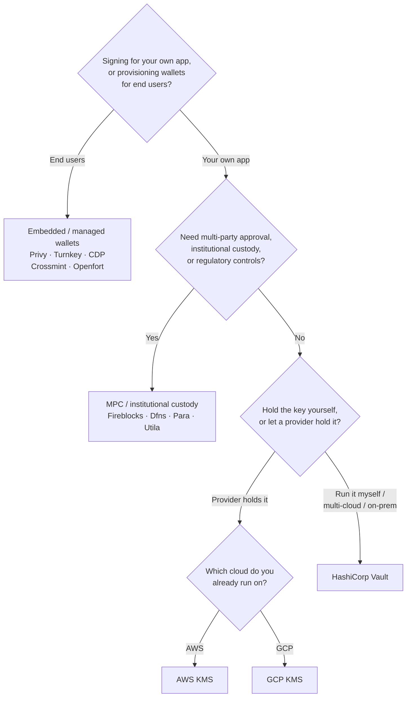

Keychain stellt eine einheitliche `SolanaSigner`-Schnittstelle für alle Backends
bereit, sodass die Wahl operativer und nicht architektonischer Natur ist – Sie
können sie später über die Konfiguration ändern. Daher **beginnen Sie mit Ihren
Anforderungen, nicht mit einem Produkt.** Zwei Fragen entscheiden das meiste:
_Wo befindet sich der private Schlüssel, und wer ist berechtigt, eine Signatur
damit zu autorisieren?_

Es gibt kein einziges bestes Backend. Jedes passt besser zu einem bestimmten
Satz von Anforderungen – die Cloud, auf der Sie bereits betreiben, ob Sie eine
Schlüsselinfrastruktur betreiben möchten und welche Verwahrungs- und
Genehmigungskontrollen Sie benötigen. Der nachfolgende Ablauf ordnet diese
Anforderungen einem Backend zu.

<Callout type="info">
  Dieser Leitfaden behandelt das Backend-seitige (serverseitige) Signieren. Wenn
  Ihre Endbenutzer ihre eigenen Transaktionen im Browser signieren, verwenden
  Sie stattdessen eine Wallet über den Wallet Standard – siehe [Signieren in der
  Produktion](/docs/core/transactions/signing-in-production).
</Callout>

## Entscheidungsablauf

<Callout type="info">
  Lokale Entwicklung und Tests benötigen nichts davon – verwenden Sie das
  **Memory**-Backend für Prototypen und wechseln Sie dann über die Konfiguration
  zu einem der oben genannten Produktions-Backends.
</Callout>

## Die Fragen durchgehen

<Steps>

<Step>

### Signieren Sie für Ihre eigene Anwendung oder für Ihre Endbenutzer?

Wenn Sie Wallets bereitstellen, die **Endbenutzer** besitzen und betreiben
(Consumer-Apps, Onboarding-Abläufe), verwenden Sie ein **eingebettetes /
verwaltetes Wallet**-Backend – Privy, Turnkey, CDP, Crossmint oder Openfort.
Diese verwalten benutzerindividuelle Wallets und die Authentifizierung in Ihrem
Namen.

Wenn Sie als **Ihre eigene Anwendung** signieren — als Gebührenzahler, Treasury
oder Backend-Automatisierung — fahren Sie unten fort.

</Step>

<Step>

### Benötigen Sie eine Mehrparteien-Genehmigung, institutionelle Verwahrung oder regulatorische Kontrollen?

Wenn Signaturen eine Genehmigungsrichtlinie, ein Ausgabenlimit oder einen
Compliance-Workflow durchlaufen müssen, bevor sie erzeugt werden — oder Sie
einen regulierten Verwahrer benötigen, der die Schlüssel hält — verwenden Sie
ein **MPC / institutionelles Verwahrung**-Backend: Fireblocks, Dfns, Para oder
Utila. Diese teilen oder verwahren den Schlüssel und co-signieren gemäß Ihrer
Richtlinie.

Wenn Sie nur einen Schlüssel benötigen, der auf Anfrage signiert, fahren Sie
unten fort.

</Step>

<Step>

### Möchten Sie den Schlüssel selbst verwalten oder von einem Anbieter verwalten lassen?

Wenn ein Cloud-Anbieter den Schlüssel in hardware-gesicherter Infrastruktur
halten und Ihre IAM-Richtlinie steuern soll, wer signieren kann, verwenden Sie
das KMS dieser Cloud:

- **Auf AWS betrieben** → AWS KMS
- **Auf GCP betrieben** → GCP KMS

Wenn Sie die Schlüsselinfrastruktur selbst betreiben möchten — oder Sie
multi-cloud oder on-prem arbeiten — verwenden Sie **HashiCorp Vault**. Sie
betreiben und prüfen es selbst; der Schlüssel verbleibt in der Transit-Engine
und signiert auf Anfrage.

</Step>

</Steps>

## Verwahrungsmodelle

Die Backends lassen sich in fünf Verwahrungsmodelle einteilen. Der obige
Entscheidungsbaum führt Sie zu einem davon.

- **Self-Custody (im Prozess)** — Ihre Anwendung hält den rohen privaten
  Schlüssel. Praktisch für die Entwicklung, aber ungeeignet für den
  Produktionsbetrieb. Backend: **Memory**.
- **Selbst gehostetes Schlüsselmanagement** — Sie betreiben die
  Schlüsselinfrastruktur selbst; der Schlüssel verbleibt darin und signiert auf
  Anfrage. Backend: **HashiCorp Vault**.
- **Cloud KMS / HSM** — ein Cloud-Anbieter speichert den Schlüssel in
  hardware-gesicherter Infrastruktur; der Schlüssel verlässt den Dienst nie, und
  Ihre IAM-Richtlinie steuert, wer signieren kann. Backends: **AWS KMS**, **GCP
  KMS**.
- **MPC & institutionelle Verwahrung** — der Schlüssel wird aufgeteilt oder bei
  einem Anbieter verwahrt, der gemäß Ihrer Richtlinie co-signiert
  (Genehmigungen, Limits). Backends: **Fireblocks**, **Dfns**, **Para**,
  **Utila**.
- **Eingebettete & verwaltete Wallets** — ein Anbieter verwaltet Wallets in
  Ihrem Auftrag, häufig zur Einbindung von Endbenutzern. Backends: **Privy**,
  **Turnkey**, **CDP**, **Crossmint**, **Openfort**.

## Backend-Vergleich

| Backend         | Verwahrungsmodell                     | Am besten geeignet für                         | Hinweise                                                                |
| --------------- | ------------------------------------- | ---------------------------------------------- | ----------------------------------------------------------------------- |
| Memory          | Eigene Verwahrung (In-Process)        | Lokale Entwicklung, Tests, CI                  | Roher Schlüssel im Prozess – nicht in der Produktion verwenden          |
| HashiCorp Vault | Self-hosted Schlüsselverwaltung       | Teams mit eigener Schlüsselinfrastruktur       | Transit-Engine; Betrieb und Auditierung liegen beim Nutzer              |
| AWS KMS         | Cloud-KMS / HSM                       | Backends auf AWS                               | Schlüssel verlässt KMS nie; IAM steuert das Signieren                   |
| GCP KMS         | Cloud-KMS / HSM                       | Backends auf GCP                               | Schlüssel verlässt KMS nie; IAM steuert das Signieren                   |
| Fireblocks      | MPC / institutionelle Verwahrung      | Treasuries, Börsen, regulierte Verwahrung      | Policy-Engine und Genehmigungsworkflows                                 |
| Dfns            | MPC-Wallet-Infrastruktur              | Programmatische Wallets mit Policy-Steuerung   | Ed25519-Signierung                                                      |
| Para            | MPC-Wallets                           | Apps mit MPC-gestützten Wallets                | API-Schlüssel + Wallet-ID                                               |
| Utila           | MPC-Verwahrung + Co-Signer            | Bestehende Utila-verwaltete Solana-Wallets     | `signMessage` nicht unterstützt; Transaktion wird vom Nutzer übertragen |
| Privy           | Eingebettete Wallets                  | Consumer-Apps zur Wallet-Einführung für Nutzer | App-verwaltete eingebettete Wallets                                     |
| Turnkey         | Nicht-verwahrende Schlüsselverwaltung | Programmatisches, policy-gesteuertes Signieren | Nicht-verwahrende Schlüsselverwaltung                                   |
| CDP             | Verwaltetes Wallet (Coinbase)         | Apps auf der Coinbase Developer Platform       | `signMessage` akzeptiert nur UTF-8-Payloads                             |
| Crossmint       | Verwaltete Wallets                    | Marktplätze und Apps mit verwalteten Wallets   | `smart` und `mpc` Wallets; `signMessage` nicht unterstützt              |
| Openfort        | Eingebettete Backend-Wallets          | Serverseitige Wallets                          | TEE-gespeicherte Schlüssel                                              |

## Enterprise-Szenarien

Eine einzelne Anwendung benötigt häufig mehrere dieser Optionen gleichzeitig. Da
die Schnittstelle identisch ist, kann pro Rolle ein anderes Backend verwendet
werden, ohne dass Aufrufstellen geändert werden müssen.

- **Treasury-Operationen** — trennen Sie einen operativen „Hot“-Signer von einem
  „Cold“- Treasury-Signer. Sichern Sie den Treasury mit MPC-Verwahrung oder
  einem Cloud-HSM und verlangen Sie Genehmigungsrichtlinien vor hochwertigen
  Signaturen.
- **Genehmigungsworkflows** — MPC- und Verwahrungsbackends (z. B. Fireblocks)
  erzwingen eine Multi-Party-Genehmigung, bevor eine Signatur erstellt wird.
- **Compliance und Audit** — Cloud-KMS (AWS/GCP) und Vault erzeugen
  Signatur-Audit- Logs; institutionelle Verwahrer ergänzen
  Richtliniendurchsetzung und Berichterstattung.
- **Regulierte Umgebungen** — bewahren Sie Schlüsselmaterial in einem HSM, KMS
  oder institutionellen Verwahrer auf, sodass Rohschlüssel Ihre Anwendung
  niemals berühren.

Siehe
[Produktions-Best-Practices](/docs/tools/keychain/production-best-practices) für
den sicheren Betrieb dieser Backends.

<Cards>
  <Card title="Rust-Leitfaden" href="/docs/tools/keychain/getting-started/rust">
    Konfigurieren Sie jedes Backend in Rust.
  </Card>
  <Card
    title="TypeScript-Leitfaden"
    href="/docs/tools/keychain/getting-started/typescript"
  >
    Konfigurieren Sie jedes Backend in TypeScript.
  </Card>
</Cards>
