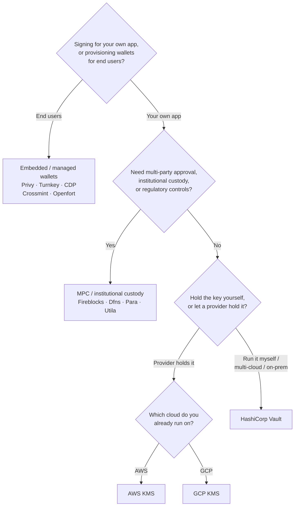

Το Keychain εκθέτει ένα ενιαίο `SolanaSigner` interface σε κάθε backend, οπότε η
επιλογή είναι λειτουργική, όχι αρχιτεκτονική — μπορείτε να την αλλάξετε αργότερα
μέσω διαμόρφωσης. Γι' αυτό, **ξεκινήστε από τις απαιτήσεις σας, όχι από ένα
προϊόν.** Δύο ερωτήματα αποφασίζουν το μεγαλύτερο μέρος: _πού βρίσκεται το
ιδιωτικό κλειδί και ποιος έχει δικαίωμα να εξουσιοδοτήσει μια υπογραφή με αυτό;_

Δεν υπάρχει ένα μοναδικό καλύτερο backend. Το καθένα ταιριάζει καλύτερα σε ένα
συγκεκριμένο σύνολο περιορισμών — το cloud στο οποίο ήδη εκτελείτε, αν θέλετε να
διαχειριστείτε υποδομή κλειδιών και τους ελέγχους φύλαξης και έγκρισης που
απαιτείται να έχετε. Η ροή παρακάτω αντιστοιχίζει αυτούς τους περιορισμούς σε
ένα backend.

<Callout type="info">
  Αυτός ο οδηγός καλύπτει την υπογραφή από πλευράς backend (server-side). Όταν
  οι τελικοί χρήστες σας υπογράφουν τις δικές τους συναλλαγές σε πρόγραμμα
  περιήγησης, χρησιμοποιήστε ένα πορτοφόλι μέσω του Wallet Standard — δείτε
  [Υπογραφή σε Παραγωγή](/docs/core/transactions/signing-in-production).
</Callout>

## Ροή απόφασης

<Callout type="info">
  Η τοπική ανάπτυξη και οι δοκιμές δεν χρειάζονται τίποτα από αυτά —
  χρησιμοποιήστε το backend **Memory** για πρωτοτυποποίηση και στη συνέχεια
  μεταβείτε σε ένα από τα παραπάνω backends παραγωγής μέσω διαμόρφωσης.
</Callout>

## Εξετάστε τα ερωτήματα

<Steps>

<Step>

### Υπογράφετε για τη δική σας εφαρμογή ή για τους τελικούς χρήστες σας;

Αν παρέχετε πορτοφόλια που **τελικοί χρήστες** κατέχουν και διαχειρίζονται
(εφαρμογές καταναλωτών, ροές ενσωμάτωσης), χρησιμοποιήστε ένα backend
**ενσωματωμένου / διαχειριζόμενου πορτοφολιού** — Privy, Turnkey, CDP, Crossmint
ή Openfort. Αυτά διαχειρίζονται πορτοφόλια ανά χρήστη και τον έλεγχο ταυτότητας
για λογαριασμό σας.

Αν υπογράφετε ως **δική σας εφαρμογή** — ένας πληρωτής τελών, ένα ταμείο,
αυτοματισμός backend — συνεχίστε παρακάτω.

</Step>

<Step>

### Χρειάζεστε έγκριση πολλών μερών, θεσμική φύλαξη ή κανονιστικούς ελέγχους;

Αν οι υπογραφές πρέπει να περάσουν από πολιτική έγκρισης, όριο δαπανών ή ροή
εργασίας συμμόρφωσης πριν παραχθούν — ή χρειάζεστε έναν ρυθμιζόμενο θεματοφύλακα
που κατέχει τα κλειδιά — χρησιμοποιήστε ένα **MPC / θεσμικό backend φύλαξης**:
Fireblocks, Dfns, Para ή Utila. Αυτά διαχωρίζουν ή φυλάσσουν το κλειδί και
συνυπογράφουν σύμφωνα με την πολιτική σας.

Αν χρειάζεστε μόνο ένα κλειδί που υπογράφει κατ' αίτηση, συνεχίστε παρακάτω.

</Step>

<Step>

### Θέλετε να κρατάτε το κλειδί μόνοι σας ή να το κρατά ένας πάροχος;

Αν ένας πάροχος cloud πρέπει να κρατά το κλειδί σε υποδομή υποστηριζόμενη από
hardware και η πολιτική IAM σας ελέγχει ποιος μπορεί να υπογράφει,
χρησιμοποιήστε το KMS του αντίστοιχου cloud:

- **Εκτέλεση σε AWS** → AWS KMS
- **Εκτέλεση σε GCP** → GCP KMS

Αν θέλετε να διαχειρίζεστε μόνοι σας την υποδομή κλειδιών — ή λειτουργείτε σε
multi-cloud ή on-prem περιβάλλον — χρησιμοποιήστε το **HashiCorp Vault**. Το
εκτελείτε και το ελέγχετε εσείς· το κλειδί παραμένει στον κινητήρα Transit και
υπογράφει κατ' αίτηση.

</Step>

</Steps>

## Μοντέλα φύλαξης

Τα backends ομαδοποιούνται σε πέντε μοντέλα φύλαξης. Η παραπάνω ροή σάς
τοποθετεί σε ένα από αυτά.

- **Αυτο-φύλαξη (εντός διεργασίας)** — η εφαρμογή σας κρατά το ακατέργαστο
  ιδιωτικό κλειδί. Βολικό για ανάπτυξη, αλλά ακατάλληλο για παραγωγή. Backend:
  **Memory**.
- **Αυτο-διαχειριζόμενη διαχείριση κλειδιών** — διαχειρίζεστε εσείς την υποδομή
  κλειδιών· το κλειδί παραμένει εντός αυτής και υπογράφει κατ' αίτηση. Backend:
  **HashiCorp Vault**.
- **Cloud KMS / HSM** — ένας πάροχος cloud αποθηκεύει το κλειδί σε υποδομή
  υποστηριζόμενη από hardware· το κλειδί δεν εξέρχεται ποτέ από την υπηρεσία και
  η πολιτική IAM σας ελέγχει ποιος μπορεί να υπογράφει. Backends: **AWS KMS**,
  **GCP KMS**.
- **MPC & θεσμική φύλαξη** — το κλειδί διαχωρίζεται ή φυλάσσεται μέσω παρόχου, ο
  οποίος συνυπογράφει σύμφωνα με την πολιτική σας (εγκρίσεις, όρια). Backends:
  **Fireblocks**, **Dfns**, **Para**, **Utila**.
- **Ενσωματωμένα & διαχειριζόμενα πορτοφόλια** — ένας πάροχος διαχειρίζεται
  πορτοφόλια εκ μέρους σας, συχνά για την ενσωμάτωση τελικών χρηστών. Backends:
  **Privy**, **Turnkey**, **CDP**, **Crossmint**, **Openfort**.

## Σύγκριση backend

| Backend         | Μοντέλο φύλαξης                        | Ιδανικό για                                              | Σημειώσεις                                                          |
| --------------- | -------------------------------------- | -------------------------------------------------------- | ------------------------------------------------------------------- |
| Memory          | Αυτο-φύλαξη (εντός διεργασίας)         | Τοπική ανάπτυξη, δοκιμές, CI                             | Ακατέργαστο κλειδί στη διεργασία — μη χρησιμοποιείτε σε παραγωγή    |
| HashiCorp Vault | Αυτο-φιλοξενούμενη διαχείριση κλειδιών | Ομάδες που διαχειρίζονται τη δική τους υποδομή κλειδιών  | Μηχανή Transit· εσείς τη λειτουργείτε και την ελέγχετε              |
| AWS KMS         | Cloud KMS / HSM                        | Backends που εκτελούνται στο AWS                         | Το κλειδί δεν εγκαταλείπει ποτέ το KMS· το IAM ελέγχει την υπογραφή |
| GCP KMS         | Cloud KMS / HSM                        | Backends που εκτελούνται στο GCP                         | Το κλειδί δεν εγκαταλείπει ποτέ το KMS· το IAM ελέγχει την υπογραφή |
| Fireblocks      | MPC / θεσμική φύλαξη                   | Ταμεία, ανταλλακτήρια, ρυθμιζόμενη φύλαξη                | Μηχανή πολιτικών και ροές εγκρίσεων                                 |
| Dfns            | Υποδομή πορτοφολιών MPC                | Προγραμματικά πορτοφόλια με ελέγχους πολιτικής           | Υπογραφή Ed25519                                                    |
| Para            | Πορτοφόλια MPC                         | Εφαρμογές που θέλουν πορτοφόλια με υποστήριξη MPC        | API key + wallet ID                                                 |
| Utila           | Φύλαξη MPC + συν-υπογράφων             | Υπάρχοντα πορτοφόλια Solana διαχειριζόμενα από Utila     | `signMessage` μη υποστηριζόμενο· εσείς μεταδίδετε το tx             |
| Privy           | Ενσωματωμένα πορτοφόλια                | Εφαρμογές καταναλωτών που εισάγουν χρήστες σε πορτοφόλια | Ενσωματωμένα πορτοφόλια διαχειριζόμενα από εφαρμογή                 |
| Turnkey         | Μη-θεματοφυλακική διαχείριση κλειδιών  | Προγραμματική, υπογραφή με έλεγχο πολιτικής              | Μη-θεματοφυλακική διαχείριση κλειδιών                               |
| CDP             | Διαχειριζόμενο πορτοφόλι (Coinbase)    | Εφαρμογές στην Πλατφόρμα Coinbase Developer              | `signMessage` αποδέχεται μόνο φορτία UTF-8                          |
| Crossmint       | Διαχειριζόμενα πορτοφόλια              | Αγορές και εφαρμογές διαχειριζόμενων πορτοφολιών         | `smart` και `mpc` πορτοφόλια· `signMessage` μη υποστηριζόμενο       |
| Openfort        | Ενσωματωμένα πορτοφόλια backend        | Πορτοφόλια από πλευράς διακομιστή                        | Κλειδιά αποθηκευμένα σε TEE                                         |

## Εταιρικά σενάρια

Μια εφαρμογή συχνά χρειάζεται περισσότερα από ένα από αυτά ταυτόχρονα. Επειδή η
διεπαφή είναι πανομοιότυπη, μπορείτε να εκτελέσετε διαφορετικό backend ανά ρόλο
χωρίς να αλλάξετε τα σημεία κλήσης.

- **Λειτουργίες ταμείου** — διαχωρίστε έναν λειτουργικό «hot» υπογράφοντα από
  έναν «cold» υπογράφοντα ταμείου. Υποστηρίξτε το ταμείο με θεματοφυλακή MPC ή
  cloud HSM και απαιτήστε πολιτικές έγκρισης πριν από υπογραφές υψηλής αξίας.
- **Ροές εργασίας έγκρισης** — τα backends MPC και θεματοφυλακής (π.χ.
  Fireblocks) επιβάλλουν έγκριση πολλών μερών πριν παραχθεί μια υπογραφή.
- **Συμμόρφωση και έλεγχος** — το cloud KMS (AWS/GCP) και το Vault εκπέμπουν
  αρχεία καταγραφής ελέγχου υπογραφής· οι θεσμικοί θεματοφύλακες προσθέτουν
  επιβολή πολιτικής και αναφορά.
- **Ρυθμιζόμενα περιβάλλοντα** — διατηρήστε το υλικό κλειδιών σε HSM, KMS ή
  θεσμικό θεματοφύλακα ώστε τα ακατέργαστα κλειδιά να μην αγγίζουν ποτέ την
  εφαρμογή σας.

Δείτε τις
[Βέλτιστες πρακτικές παραγωγής](/docs/tools/keychain/production-best-practices)
για την ασφαλή λειτουργία αυτών των backends.

<Cards>
  <Card title="Οδηγός Rust" href="/docs/tools/keychain/getting-started/rust">
    Ρυθμίστε κάθε backend σε Rust.
  </Card>
  <Card
    title="Οδηγός TypeScript"
    href="/docs/tools/keychain/getting-started/typescript"
  >
    Ρυθμίστε κάθε backend σε TypeScript.
  </Card>
</Cards>
