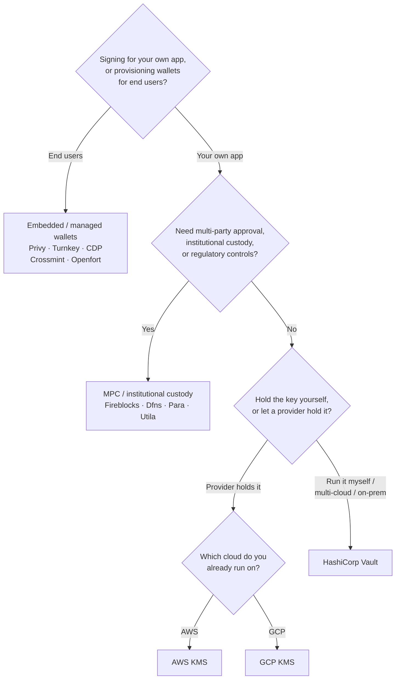

Keychain expone una interfaz `SolanaSigner` única para todos los backends, por
lo que la elección es operativa, no arquitectónica — puedes cambiarla más
adelante mediante configuración. Por eso, **parte de tus requisitos, no de un
producto.** Dos preguntas resuelven la mayor parte: _¿dónde reside la clave
privada y quién está autorizado a aprobar una firma con ella?_

No existe un único backend óptimo. Cada uno se adapta mejor a un conjunto
específico de restricciones: la nube en la que ya operas, si quieres gestionar
infraestructura de claves y qué controles de custodia y aprobación debes tener.
El flujo a continuación mapea esas restricciones a un backend.

<Callout type="info">
  Esta guía cubre la firma del lado del servidor (backend). Cuando tus usuarios
  finales firman sus propias transacciones en un navegador, utiliza una wallet a
  través del Wallet Standard — consulta [Firma en
  Producción](/docs/core/transactions/signing-in-production).
</Callout>

## Flujo de decisión

<Callout type="info">
  El desarrollo local y las pruebas no necesitan nada de esto — usa el backend
  **Memory** para prototipos y luego cambia a uno de los backends de producción
  anteriores mediante configuración.
</Callout>

## Recorre las preguntas

<Steps>

<Step>

### ¿Estás firmando para tu propia aplicación o para tus usuarios finales?

Si aprovisionas wallets que los **usuarios finales** poseen y operan
(aplicaciones de consumo, flujos de incorporación), utiliza un backend de
**wallet integrada / gestionada** — Privy, Turnkey, CDP, Crossmint u Openfort.
Estos gestionan wallets por usuario y la autenticación en tu nombre.

Si estás firmando como **tu propia aplicación** — un pagador de tarifas, una
tesorería, automatización de backend — continúa a continuación.

</Step>

<Step>

### ¿Necesitas aprobación de múltiples partes, custodia institucional o controles regulatorios?

Si las firmas deben superar una política de aprobación, límite de gasto o flujo
de trabajo de cumplimiento antes de generarse — o necesitas un custodio regulado
que gestione las claves — utiliza un backend de **MPC / custodia
institucional**: Fireblocks, Dfns, Para o Utila. Estos dividen o custodian la
clave y co-firman según tu política.

Si solo necesitas una clave que firme a solicitud, continúa a continuación.

</Step>

<Step>

### ¿Quieres gestionar la clave tú mismo o dejar que un proveedor la gestione?

Si un proveedor de nube debe almacenar la clave en infraestructura respaldada
por hardware y tu política de IAM controla quién puede firmar, utiliza el KMS de
ese proveedor:

- **Ejecutando en AWS** → AWS KMS
- **Ejecutando en GCP** → GCP KMS

Si deseas operar la infraestructura de claves tú mismo — o utilizas múltiples
nubes o estás en local — usa **HashiCorp Vault**. Tú lo ejecutas y auditas; la
clave permanece dentro del motor Transit y firma a solicitud.

</Step>

</Steps>

## Modelos de custodia

Los backends se agrupan en cinco modelos de custodia. El flujo anterior te lleva
a uno de ellos.

- **Autocustodia (en proceso)** — tu aplicación almacena la clave privada sin
  procesar. Conveniente para el desarrollo, pero no apta para producción.
  Backend: **Memory**.
- **Gestión de claves autoalojada** — tú operas la infraestructura de claves; la
  clave permanece dentro de ella y firma a solicitud. Backend: **HashiCorp
  Vault**.
- **Cloud KMS / HSM** — un proveedor de nube almacena la clave en
  infraestructura respaldada por hardware; la clave nunca abandona el servicio y
  tu política de IAM controla quién puede firmar. Backends: **AWS KMS**, **GCP
  KMS**.
- **MPC y custodia institucional** — la clave se divide o custodia a través de
  un proveedor, que co-firma según tu política (aprobaciones, límites).
  Backends: **Fireblocks**, **Dfns**, **Para**, **Utila**.
- **Carteras integradas y gestionadas** — un proveedor gestiona carteras en tu
  nombre, a menudo para incorporar usuarios finales. Backends: **Privy**,
  **Turnkey**, **CDP**, **Crossmint**, **Openfort**.

## Comparación de backends

| Backend         | Modelo de custodia             | Ideal para                                                | Notas                                                      |
| --------------- | ------------------------------ | --------------------------------------------------------- | ---------------------------------------------------------- |
| Memory          | Autocustodia (en proceso)      | Desarrollo local, pruebas, CI                             | Clave en texto plano en el proceso — no usar en producción |
| HashiCorp Vault | Gestión de claves autoalojada  | Equipos que gestionan su propia infraestructura de claves | Motor Transit; tú lo operas y auditas                      |
| AWS KMS         | KMS / HSM en la nube           | Backends ejecutados en AWS                                | La clave nunca sale de KMS; IAM controla la firma          |
| GCP KMS         | KMS / HSM en la nube           | Backends ejecutados en GCP                                | La clave nunca sale de KMS; IAM controla la firma          |
| Fireblocks      | Custodia MPC / institucional   | Tesorerías, exchanges, custodia regulada                  | Motor de políticas y flujos de aprobación                  |
| Dfns            | Infraestructura de wallets MPC | Wallets programáticas con controles de política           | Firma Ed25519                                              |
| Para            | Wallets MPC                    | Apps que desean wallets respaldadas por MPC               | API key + wallet ID                                        |
| Utila           | Custodia MPC + co-firmante     | Wallets Solana gestionadas por Utila                      | `signMessage` no compatible; tú emites la transacción      |
| Privy           | Wallets embebidas              | Apps de consumo que incorporan usuarios a wallets         | Wallets embebidas gestionadas por la app                   |
| Turnkey         | Gestión de claves sin custodia | Firma programática con control de políticas               | Gestión de claves sin custodia                             |
| CDP             | Wallet gestionada (Coinbase)   | Apps en Coinbase Developer Platform                       | `signMessage` solo acepta payloads UTF-8                   |
| Crossmint       | Wallets gestionadas            | Marketplaces y apps de wallets gestionadas                | Wallets `smart` e `mpc`; `signMessage` no compatible       |
| Openfort        | Wallets backend embebidas      | Wallets del lado del servidor                             | Claves almacenadas en TEE                                  |

## Escenarios empresariales

Una sola aplicación a menudo necesita más de uno de estos al mismo tiempo. Dado
que la interfaz es idéntica, puedes ejecutar un backend diferente por rol sin
cambiar los puntos de llamada.

- **Operaciones de tesorería** — separa un firmante "activo" operacional de un
  firmante "frío" de tesorería. Respalda la tesorería con custodia MPC o un HSM
  en la nube y requiere políticas de aprobación antes de firmas de alto valor.
- **Flujos de aprobación** — los backends de MPC y custodia (p. ej., Fireblocks)
  aplican la aprobación de múltiples partes antes de producir una firma.
- **Cumplimiento y auditoría** — los KMS en la nube (AWS/GCP) y Vault emiten
  registros de auditoría de firma; los custodios institucionales añaden
  cumplimiento de políticas e informes.
- **Entornos regulados** — mantén el material de claves en un HSM, KMS o
  custodio institucional para que las claves sin procesar nunca toquen tu
  aplicación.

Consulta
[Mejores prácticas para producción](/docs/tools/keychain/production-best-practices)
para operar estos backends de forma segura.

<Cards>
  <Card title="Guía de Rust" href="/docs/tools/keychain/getting-started/rust">
    Configura cada backend en Rust.
  </Card>
  <Card
    title="Guía de TypeScript"
    href="/docs/tools/keychain/getting-started/typescript"
  >
    Configura cada backend en TypeScript.
  </Card>
</Cards>
