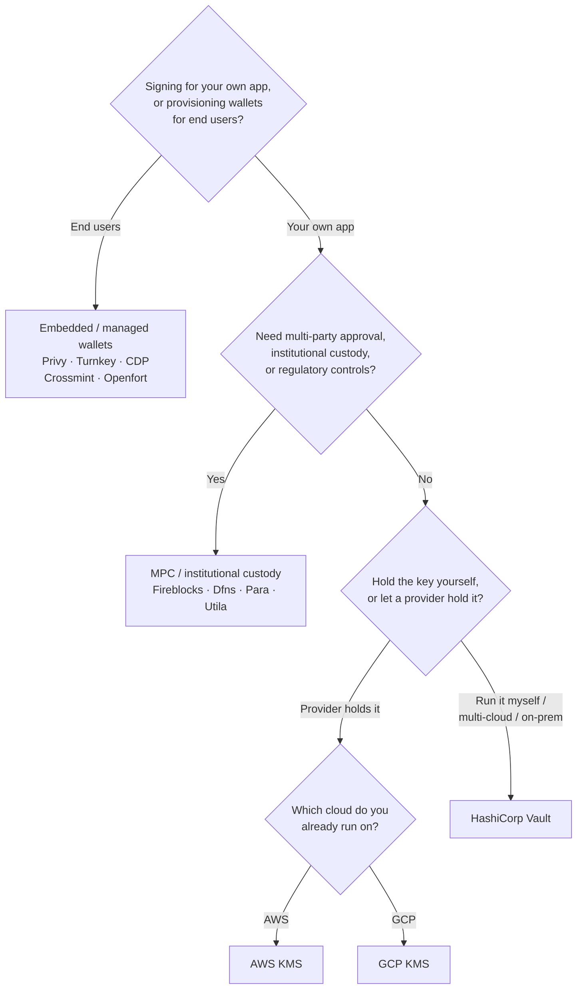

Keychain tarjoaa yhden `SolanaSigner`-rajapinnan kaikkien backendien yli, joten
valinta on operatiivinen, ei arkkitehtoninen — voit muuttaa sitä myöhemmin
konfiguraation kautta. Tämän vuoksi **aloita vaatimuksistasi, älä tuotteesta.**
Kaksi kysymystä ratkaisee useimmat tapaukset: _missä yksityinen avain sijaitsee,
ja kuka saa valtuuttaa sillä allekirjoituksen?_

Ei ole olemassa yhtä parasta backendiä. Kukin sopii parhaiten tiettyyn
rajoitekokonaisuuteen — pilvipalveluun, jota jo käytät, siihen haluatko
ylläpitää avaininfrastruktuuria, sekä siihen mitä säilytys- ja
hyväksyntäkontrolleja sinulta vaaditaan. Alla oleva vuokaavio yhdistää nämä
rajoitteet backendiin.

<Callout type="info">
  Tämä opas käsittelee backend-puolen (palvelinpuoli) allekirjoittamista. Kun
  loppukäyttäjäsi allekirjoittavat omia transaktioitaan selaimessa, käytä sen
  sijaan lompakkoa Wallet Standardin kautta — katso [Allekirjoittaminen
  tuotannossa](/docs/core/transactions/signing-in-production).
</Callout>

## Päätösvuokaavio

<Callout type="info">
  Paikallinen kehitys ja testit eivät tarvitse mitään tästä — käytä **Memory**-
  backendiä prototyyppien tekemiseen, ja vaihda sitten johonkin yllä olevista
  tuotantobackendeistä konfiguraation kautta.
</Callout>

## Käy kysymykset läpi

<Steps>

<Step>

### Allekirjoitatko omalle sovelluksellesi vai loppukäyttäjillesi?

Jos tarjoat lompakkoja, jotka **loppukäyttäjät** omistavat ja hallitsevat
(kuluttajasovellukset, käyttöönottovirtaukset), käytä **upotettua / hallinnoitua
lompakko** -backendiä — Privy, Turnkey, CDP, Crossmint tai Openfort. Nämä
hallinnoivat käyttäjäkohtaisia lompakkoja ja todennusta puolestasi.

Jos allekirjoitat **omana sovelluksenasi** — maksajana, treasuryna,
taustajärjestelmän automaationa — jatka alla.

</Step>

<Step>

### Tarvitsetko moniosapuolista hyväksyntää, institutionaalista säilytystä tai sääntelynmukaisia hallintakeinoja?

Jos allekirjoitusten on läpäistävä hyväksyntäkäytäntö, käyttöraja tai
vaatimustenmukaisuustyönkulku ennen niiden tuottamista — tai tarvitset
säännellyn säilyttäjän pitämään avaimet — käytä **MPC / institutionaalinen
säilytys** -taustajärjestelmää: Fireblocks, Dfns, Para tai Utila. Nämä jakavat
tai säilyttävät avaimen ja allekirjoittavat yhdessä käytäntösi mukaan.

Jos tarvitset vain avaimen, joka allekirjoittaa pyydettäessä, jatka alla.

</Step>

<Step>

### Haluatko pitää avaimen itselläsi vai antaa palveluntarjoajan hallinnoida sitä?

Jos pilvipalveluntarjoajan tulisi pitää avain laitteistopohjaisessa
infrastruktuurissa ja IAM-käytäntösi hallinnoi allekirjoitusoikeuksia, käytä
kyseisen pilvipalvelun KMS:ää:

- **Käytössä AWS** → AWS KMS
- **Käytössä GCP** → GCP KMS

Jos haluat hallinnoida avaininfrastruktuuria itse — tai olet monipilvi- tai
on-prem-ympäristössä — käytä **HashiCorp Vaultia**. Hallinnoit ja auditoit sen
itse; avain pysyy Transit-moottorin sisällä ja allekirjoittaa pyydettäessä.

</Step>

</Steps>

## Säilytysmallit

Taustajärjestelmät ryhmittyvät viiteen säilytysmalliin. Yllä oleva kulku ohjaa
sinut yhteen niistä.

- **Oma säilytys (prosessinsisäinen)** — sovelluksesi pitää raakaa
  yksityisavainta hallussaan. Kätevä kehityskäyttöön, mutta soveltumaton
  tuotantoon. Taustajärjestelmä: **Memory**.
- **Itse isännöity avaintenhallinta** — hallinnoit avaininfrastruktuuria itse;
  avain pysyy sen sisällä ja allekirjoittaa pyydettäessä. Taustajärjestelmä:
  **HashiCorp Vault**.
- **Pilvi-KMS / HSM** — pilvipalveluntarjoaja tallentaa avaimen
  laitteistopohjaiseen infrastruktuuriin; avain ei koskaan poistu palvelusta ja
  IAM-käytäntösi hallinnoi allekirjoitusoikeuksia. Taustajärjestelmät: **AWS
  KMS**, **GCP KMS**.
- **MPC & institutionaalinen säilytys** — avain on jaettu tai säilytetty
  palveluntarjoajan hallinnassa, joka allekirjoittaa yhdessä käytäntösi mukaan
  (hyväksynnät, rajat). Taustajärjestelmät: **Fireblocks**, **Dfns**, **Para**,
  **Utila**.
- **Upotetut ja hallinnoidut lompakot** — palveluntarjoaja hallinnoi lompakoita
  puolestasi, usein loppukäyttäjien käyttöönoton helpottamiseksi.
  Taustajärjestelmät: **Privy**, **Turnkey**, **CDP**, **Crossmint**,
  **Openfort**.

## Taustajärjestelmien vertailu

| Taustajärjestelmä | Säilytysmallli                         | Parhaiten sopii                                              | Huomiot                                                         |
| ----------------- | -------------------------------------- | ------------------------------------------------------------ | --------------------------------------------------------------- |
| Memory            | Oma säilytys (prosessissa)             | Paikallinen kehitys, testit, CI                              | Raaka avain prosessissa — älä käytä tuotannossa                 |
| HashiCorp Vault   | Itse isännöity avainten hallinta       | Tiimit, jotka ylläpitävät omaa avaininfrastruktuuria         | Transit-moottori; sinä operoitat ja auditoit sen                |
| AWS KMS           | Pilvi-KMS / HSM                        | AWS:llä toimivat taustajärjestelmät                          | Avain ei koskaan poistu KMS:stä; IAM hallitsee allekirjoituksen |
| GCP KMS           | Pilvi-KMS / HSM                        | GCP:llä toimivat taustajärjestelmät                          | Avain ei koskaan poistu KMS:stä; IAM hallitsee allekirjoituksen |
| Fireblocks        | MPC / institutionaalinen säilytys      | Kassavarat, pörssit, säännelty säilytys                      | Käytäntömoottori ja hyväksymistyönkulut                         |
| Dfns              | MPC-lompakkoinfrastruktuuri            | Ohjelmistopohjaiset lompakot käytäntöhallinnalla             | Ed25519-allekirjoitus                                           |
| Para              | MPC-lompakot                           | Sovellukset, jotka haluavat MPC-tuetut lompakot              | API-avain + lompakko-ID                                         |
| Utila             | MPC-säilytys + yhteisallekirjoittaja   | Olemassa olevat Utila-hallinnoidut Solana-lompakot           | `signMessage` ei tuettu; sinä lähetät transaktion               |
| Privy             | Upotetut lompakot                      | Kuluttajasovellukset, jotka liittävät käyttäjiä lompakkoihin | Sovelluksen hallinnoimat upotetut lompakot                      |
| Turnkey           | Ei-huoltajapohjainen avainten hallinta | Ohjelmistopohjainen, käytäntöportattu allekirjoitus          | Ei-huoltajapohjainen avainten hallinta                          |
| CDP               | Hallittu lompakko (Coinbase)           | Coinbase Developer Platform -sovellukset                     | `signMessage` hyväksyy vain UTF-8-sisällön                      |
| Crossmint         | Hallinnoidut lompakot                  | Markkinapaikat ja hallinnoidut lompakkosovellukset           | `smart` ja `mpc` lompakot; `signMessage` ei tuettu              |
| Openfort          | Upotetut taustajärjestelmälompakot     | Palvelinpuolen lompakot                                      | TEE-tallennetut avaimet                                         |

## Yritysskenaariot

Yksittäinen sovellus tarvitsee usein useampaa kuin yhtä näistä samanaikaisesti.
Koska rajapinta on identtinen, voit käyttää eri taustapalvelua kullekin roolille
muuttamatta kutsupisteitä.

- **Kassatoiminnot** — erota operatiivinen "kuuma" allekirjoittaja "kylmästä"
  kassapalvelun allekirjoittajasta. Tue kassapalvelua MPC-säilytyksellä tai
  pilvi-HSM:llä ja vaadi hyväksymiskäytäntöjä ennen suuriarvoisia
  allekirjoituksia.
- **Hyväksymistyönkulut** — MPC- ja säilytystaustapalvelut (esim. Fireblocks)
  vaativat moniosapuolisen hyväksynnän ennen allekirjoituksen tuottamista.
- **Vaatimustenmukaisuus ja tarkastus** — pilvi-KMS (AWS/GCP) ja Vault tuottavat
  allekirjoitusten tarkastuslokit; institutionaaliset säilyttäjät lisäävät
  käytäntöjen valvonnan ja raportoinnin.
- **Säännellyt ympäristöt** — säilytä avainmateriaali HSM:ssä, KMS:ssä tai
  institutionaalisella säilyttäjällä, jotta raakaavaimet eivät koskaan kosketa
  sovellustasi.

Katso
[Tuotannon parhaat käytännöt](/docs/tools/keychain/production-best-practices)
näiden taustapalveluiden turvalliseen käyttämiseen.

<Cards>
  <Card title="Rust-opas" href="/docs/tools/keychain/getting-started/rust">
    Konfiguroi jokainen taustapalvelu Rustissa.
  </Card>
  <Card
    title="TypeScript-opas"
    href="/docs/tools/keychain/getting-started/typescript"
  >
    Konfiguroi jokainen taustapalvelu TypeScriptissä.
  </Card>
</Cards>
