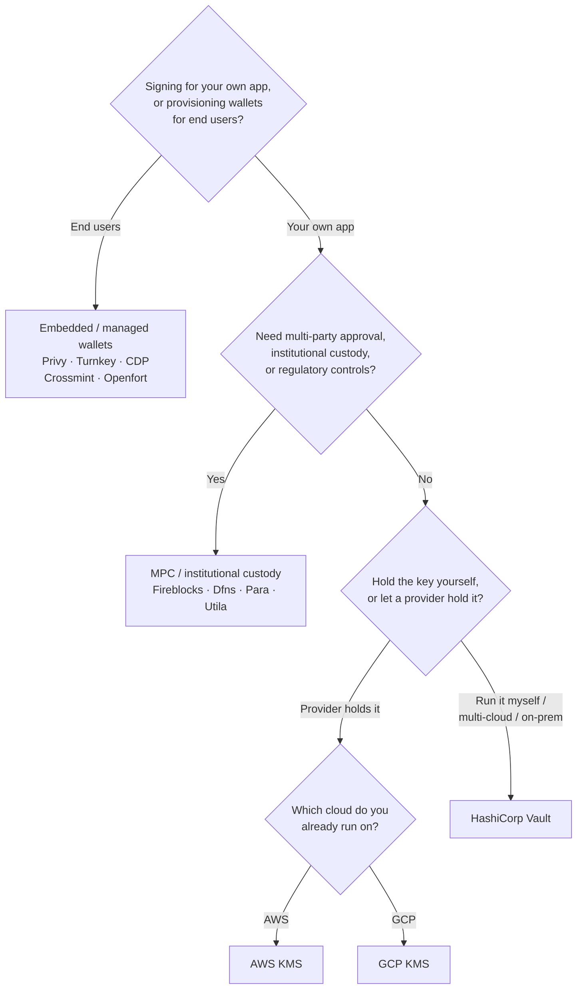

Keychain mengekspos satu antarmuka `SolanaSigner` di setiap backend, sehingga
pilihan ini bersifat operasional, bukan arsitektural — Anda dapat mengubahnya
nanti melalui konfigurasi. Oleh karena itu, **mulailah dari kebutuhan Anda,
bukan dari sebuah produk.** Dua pertanyaan menentukan sebagian besar: _di mana
kunci privat disimpan, dan siapa yang diizinkan untuk mengotorisasi tanda tangan
dengannya?_

Tidak ada satu backend terbaik. Masing-masing lebih cocok untuk sekumpulan
kendala tertentu — cloud yang sudah Anda gunakan, apakah Anda ingin
mengoperasikan infrastruktur kunci, dan kontrol kustodi serta persetujuan apa
yang wajib Anda miliki. Alur di bawah ini memetakan kendala tersebut ke sebuah
backend.

<Callout type="info">
  Panduan ini membahas penandatanganan sisi server (backend). Ketika pengguna
  akhir menandatangani transaksi mereka sendiri di browser, gunakan dompet
  melalui Wallet Standard sebagai gantinya — lihat [Penandatanganan dalam
  Produksi](/docs/core/transactions/signing-in-production).
</Callout>

## Alur keputusan

<Callout type="info">
  Pengembangan lokal dan pengujian tidak memerlukan semua ini — gunakan backend
  **Memory** untuk pembuatan prototipe, lalu beralih ke salah satu backend
  produksi di atas melalui konfigurasi.
</Callout>

## Telusuri pertanyaan-pertanyaan

<Steps>

<Step>

### Apakah Anda menandatangani untuk aplikasi Anda sendiri, atau untuk pengguna akhir Anda?

Jika Anda menyediakan dompet yang dimiliki dan dioperasikan oleh **pengguna
akhir** (aplikasi konsumen, alur orientasi), gunakan backend **dompet tertanam /
terkelola** — Privy, Turnkey, CDP, Crossmint, atau Openfort. Layanan ini
mengelola dompet per pengguna dan autentikasi atas nama Anda.

Jika Anda menandatangani sebagai **aplikasi Anda sendiri** — pembayar biaya,
perbendaharaan, otomatisasi backend — lanjutkan di bawah ini.

</Step>

<Step>

### Apakah Anda memerlukan persetujuan multi-pihak, kustodi institusional, atau kontrol regulasi?

Jika tanda tangan harus melewati kebijakan persetujuan, batas pengeluaran, atau
alur kerja kepatuhan sebelum dihasilkan — atau Anda membutuhkan kustodian
teregulasi yang menyimpan kunci — gunakan backend **MPC / kustodi
institusional**: Fireblocks, Dfns, Para, atau Utila. Layanan ini memisahkan atau
mengkustodikan kunci dan menandatangani bersama sesuai kebijakan Anda.

Jika Anda hanya membutuhkan kunci yang menandatangani sesuai permintaan,
lanjutkan di bawah ini.

</Step>

<Step>

### Apakah Anda ingin menyimpan kunci sendiri, atau membiarkan penyedia menyimpannya?

Jika penyedia cloud harus menyimpan kunci dalam infrastruktur berbasis perangkat
keras dan kebijakan IAM Anda mengontrol siapa yang dapat menandatangani, gunakan
KMS dari cloud tersebut:

- **Berjalan di AWS** → AWS KMS
- **Berjalan di GCP** → GCP KMS

Jika Anda ingin mengoperasikan infrastruktur kunci sendiri — atau Anda
menggunakan multi-cloud atau on-prem — gunakan **HashiCorp Vault**. Anda
menjalankan dan mengauditnya; kunci tetap berada di dalam mesin Transit dan
menandatangani sesuai permintaan.

</Step>

</Steps>

## Model kustodi

Backend dikelompokkan ke dalam lima model kustodi. Alur di atas akan menempatkan
Anda pada salah satunya.

- **Kustodi mandiri (dalam proses)** — aplikasi Anda menyimpan kunci privat
  mentah. Praktis untuk pengembangan, tetapi tidak cocok untuk produksi.
  Backend: **Memory**.
- **Manajemen kunci yang dihosting sendiri** — Anda mengoperasikan infrastruktur
  kunci; kunci tetap berada di dalamnya dan menandatangani sesuai permintaan.
  Backend: **HashiCorp Vault**.
- **Cloud KMS / HSM** — penyedia cloud menyimpan kunci dalam infrastruktur
  berbasis perangkat keras; kunci tidak pernah meninggalkan layanan dan
  kebijakan IAM Anda mengontrol siapa yang dapat menandatangani. Backend: **AWS
  KMS**, **GCP KMS**.
- **MPC & kustodi institusional** — kunci dipisah atau dikustodikan melalui
  penyedia, yang menandatangani bersama sesuai kebijakan Anda (persetujuan,
  batas). Backend: **Fireblocks**, **Dfns**, **Para**, **Utila**.
- **Dompet tertanam & terkelola** — penyedia mengelola dompet atas nama Anda,
  sering kali untuk orientasi pengguna akhir. Backend: **Privy**, **Turnkey**,
  **CDP**, **Crossmint**, **Openfort**.

## Perbandingan Backend

| Backend         | Model kustodi                  | Terbaik untuk                                       | Catatan                                                             |
| --------------- | ------------------------------ | --------------------------------------------------- | ------------------------------------------------------------------- |
| Memory          | Kustodi mandiri (dalam proses) | Pengembangan lokal, pengujian, CI                   | Kunci mentah dalam proses — jangan digunakan di produksi            |
| HashiCorp Vault | Manajemen kunci self-hosted    | Tim yang menjalankan infrastruktur kunci sendiri    | Transit engine; Anda yang mengoperasikan dan mengauditnya           |
| AWS KMS         | Cloud KMS / HSM                | Backend yang berjalan di AWS                        | Kunci tidak pernah meninggalkan KMS; IAM mengontrol penandatanganan |
| GCP KMS         | Cloud KMS / HSM                | Backend yang berjalan di GCP                        | Kunci tidak pernah meninggalkan KMS; IAM mengontrol penandatanganan |
| Fireblocks      | Kustodi MPC / institusional    | Treasuri, bursa, kustodi terregulasi                | Policy engine dan alur kerja persetujuan                            |
| Dfns            | Infrastruktur wallet MPC       | Wallet terprogram dengan kontrol kebijakan          | Penandatanganan Ed25519                                             |
| Para            | Wallet MPC                     | Aplikasi yang menginginkan wallet berbasis MPC      | API key + wallet ID                                                 |
| Utila           | Kustodi MPC + co-signer        | Wallet Solana yang dikelola Utila                   | `signMessage` tidak didukung; Anda yang menyiarkan tx               |
| Privy           | Wallet tersemat                | Aplikasi konsumen yang mengajak pengguna ke wallet  | Wallet tersemat yang dikelola aplikasi                              |
| Turnkey         | Manajemen kunci non-kustodial  | Penandatanganan terprogram dengan gerbang kebijakan | Manajemen kunci non-kustodial                                       |
| CDP             | Wallet terkelola (Coinbase)    | Aplikasi di Coinbase Developer Platform             | `signMessage` hanya menerima payload UTF-8                          |
| Crossmint       | Wallet terkelola               | Marketplace dan aplikasi wallet terkelola           | Wallet `smart` dan `mpc`; `signMessage` tidak didukung              |
| Openfort        | Wallet backend tersemat        | Wallet sisi server                                  | Kunci tersimpan di TEE                                              |

## Skenario enterprise

Sebuah aplikasi sering kali membutuhkan lebih dari satu di antaranya secara
bersamaan. Karena antarmukanya identik, Anda dapat menjalankan backend yang
berbeda per peran tanpa mengubah call site.

- **Operasi treasury** — pisahkan penanda tangan "hot" operasional dari penanda
  tangan treasury "cold". Dukung treasury dengan kustodi MPC atau cloud HSM dan
  terapkan kebijakan persetujuan sebelum tanda tangan bernilai tinggi.
- **Alur kerja persetujuan** — backend MPC dan kustodi (mis. Fireblocks)
  menerapkan persetujuan multi-pihak sebelum tanda tangan dihasilkan.
- **Kepatuhan dan audit** — cloud KMS (AWS/GCP) dan Vault menghasilkan log audit
  penandatanganan; kustodian institusional menambahkan penegakan kebijakan dan
  pelaporan.
- **Lingkungan yang diatur** — simpan materi kunci di HSM, KMS, atau kustodian
  institusional agar kunci mentah tidak pernah menyentuh aplikasi Anda.

Lihat [Praktik terbaik produksi](/docs/tools/keychain/production-best-practices)
untuk mengoperasikan backend ini dengan aman.

<Cards>
  <Card title="Panduan Rust" href="/docs/tools/keychain/getting-started/rust">
    Konfigurasikan setiap backend di Rust.
  </Card>
  <Card
    title="Panduan TypeScript"
    href="/docs/tools/keychain/getting-started/typescript"
  >
    Konfigurasikan setiap backend di TypeScript.
  </Card>
</Cards>
