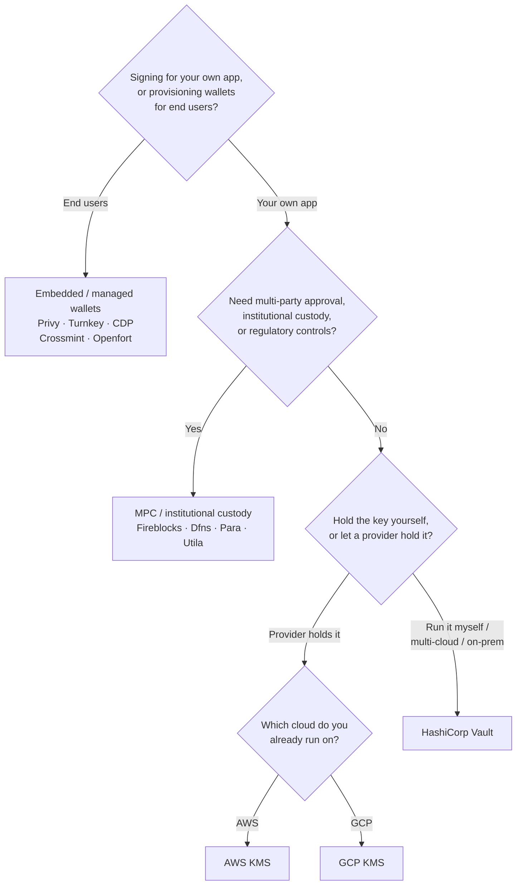

Keychain espone un'unica interfaccia `SolanaSigner` per ogni backend, quindi la
scelta è operativa, non architetturale — puoi cambiarla in seguito tramite
configurazione. Per questo motivo, **parti dalle tue esigenze, non da un
prodotto.** Due domande risolvono la maggior parte dei casi: _dove risiede la
chiave privata e chi è autorizzato a firmare con essa?_

Non esiste un backend universalmente migliore. Ognuno si adatta meglio a un
determinato insieme di vincoli — il cloud su cui già operi, se vuoi gestire
un'infrastruttura di chiavi e quali controlli di custodia e approvazione sei
tenuto ad avere. Il flusso seguente associa questi vincoli a un backend.

<Callout type="info">
  Questa guida riguarda la firma lato server (backend). Quando i tuoi utenti
  finali firmano le proprie transazioni in un browser, utilizza un wallet
  tramite il Wallet Standard — vedi [Firma in
  Produzione](/docs/core/transactions/signing-in-production).
</Callout>

## Flusso decisionale

<Callout type="info">
  Lo sviluppo locale e i test non richiedono nulla di tutto ciò — usa il backend
  **Memory** per la prototipazione, poi passa a uno dei backend di produzione
  sopra indicati tramite configurazione.
</Callout>

## Segui le domande

<Steps>

<Step>

### Stai firmando per la tua applicazione o per i tuoi utenti finali?

Se fornisci wallet che gli **utenti finali** possiedono e gestiscono (app
consumer, flussi di onboarding), utilizza un backend di **wallet incorporato /
gestito** — Privy, Turnkey, CDP, Crossmint o Openfort. Questi gestiscono i
wallet per singolo utente e l'autenticazione per tuo conto.

Se stai firmando come **tua applicazione** — un fee payer, un treasury,
un'automazione backend — continua di seguito.

</Step>

<Step>

### Hai bisogno di approvazione multi-parte, custodia istituzionale o controlli normativi?

Se le firme devono superare una policy di approvazione, un limite di spesa o un
flusso di lavoro di conformità prima di essere prodotte — o hai bisogno di un
custode regolamentato che detenga le chiavi — utilizza un backend **MPC /
custodia istituzionale**: Fireblocks, Dfns, Para o Utila. Questi suddividono o
custodiscono la chiave e co-firmano in base alla tua policy.

Se hai bisogno solo di una chiave che firma su richiesta, continua di seguito.

</Step>

<Step>

### Vuoi gestire la chiave tu stesso, o preferisci affidarla a un provider?

Se un cloud provider deve detenere la chiave in un'infrastruttura con supporto
hardware e la tua policy IAM controlla chi può firmare, utilizza il KMS di quel
cloud:

- **In esecuzione su AWS** → AWS KMS
- **In esecuzione su GCP** → GCP KMS

Se vuoi gestire tu stesso l'infrastruttura delle chiavi — o sei in ambiente
multi-cloud o on-prem — usa **HashiCorp Vault**. Sei tu a eseguirlo e
controllarlo; la chiave rimane all'interno del Transit engine e firma su
richiesta.

</Step>

</Steps>

## Modelli di custodia

I backend si raggruppano in cinque modelli di custodia. Il flusso sopra indicato
ti colloca in uno di essi.

- **Auto-custodia (in-process)** — la tua applicazione detiene la chiave privata
  grezza. Comoda per lo sviluppo, ma non adatta alla produzione. Backend:
  **Memory**.
- **Gestione delle chiavi self-hosted** — sei tu a gestire l'infrastruttura
  delle chiavi; la chiave rimane al suo interno e firma su richiesta. Backend:
  **HashiCorp Vault**.
- **Cloud KMS / HSM** — un cloud provider archivia la chiave in
  un'infrastruttura con supporto hardware; la chiave non lascia mai il servizio
  e la tua policy IAM controlla chi può firmare. Backend: **AWS KMS**, **GCP
  KMS**.
- **MPC e custodia istituzionale** — la chiave è suddivisa o custodita presso un
  provider, che co-firma in base alla tua policy (approvazioni, limiti).
  Backend: **Fireblocks**, **Dfns**, **Para**, **Utila**.
- **Wallet embedded e gestiti** — un provider gestisce i wallet per tuo conto,
  spesso per l'onboarding degli utenti finali. Backend: **Privy**, **Turnkey**,
  **CDP**, **Crossmint**, **Openfort**.

## Confronto tra backend

| Backend         | Modello di custodia            | Ideale per                                              | Note                                                            |
| --------------- | ------------------------------ | ------------------------------------------------------- | --------------------------------------------------------------- |
| Memory          | Auto-custodia (in-process)     | Sviluppo locale, test, CI                               | Chiave raw nel processo — non utilizzare in produzione          |
| HashiCorp Vault | Gestione chiavi self-hosted    | Team che gestiscono la propria infrastruttura di chiavi | Motore Transit; gestione e audit a carico dell'utente           |
| AWS KMS         | Cloud KMS / HSM                | Backend in esecuzione su AWS                            | La chiave non lascia mai KMS; IAM controlla la firma            |
| GCP KMS         | Cloud KMS / HSM                | Backend in esecuzione su GCP                            | La chiave non lascia mai KMS; IAM controlla la firma            |
| Fireblocks      | Custodia MPC / istituzionale   | Tesorerie, exchange, custodia regolamentata             | Motore di policy e flussi di approvazione                       |
| Dfns            | Infrastruttura wallet MPC      | Wallet programmatici con controlli di policy            | Firma Ed25519                                                   |
| Para            | Wallet MPC                     | App che desiderano wallet basati su MPC                 | Chiave API + ID wallet                                          |
| Utila           | Custodia MPC + co-firmatario   | Wallet Solana gestiti da Utila                          | `signMessage` non supportato; il tx viene trasmesso dall'utente |
| Privy           | Wallet integrati               | App consumer che introducono gli utenti ai wallet       | Wallet integrati gestiti dall'app                               |
| Turnkey         | Gestione chiavi non-custodiale | Firma programmatica con controllo tramite policy        | Gestione chiavi non-custodiale                                  |
| CDP             | Wallet gestito (Coinbase)      | App sulla Coinbase Developer Platform                   | `signMessage` accetta solo payload UTF-8                        |
| Crossmint       | Wallet gestiti                 | Marketplace e app con wallet gestiti                    | Wallet `smart` e `mpc`; `signMessage` non supportato            |
| Openfort        | Wallet backend integrati       | Wallet lato server                                      | Chiavi archiviate in TEE                                        |

## Scenari enterprise

Un'unica applicazione spesso ha bisogno di più di uno di questi elementi
contemporaneamente. Poiché l'interfaccia è identica, è possibile eseguire un
backend diverso per ruolo senza modificare i punti di chiamata.

- **Operazioni di tesoreria** — separare un firmatario operativo "hot" da un
  firmatario "cold" di tesoreria. Supportare la tesoreria con custodia MPC o un
  HSM cloud e richiedere politiche di approvazione prima delle firme ad alto
  valore.
- **Flussi di approvazione** — i backend MPC e di custodia (es. Fireblocks)
  impongono l'approvazione multi-parte prima che una firma venga prodotta.
- **Conformità e audit** — i KMS cloud (AWS/GCP) e Vault emettono log di audit
  delle firme; i custodi istituzionali aggiungono l'applicazione delle policy e
  la reportistica.
- **Ambienti regolamentati** — mantenere il materiale delle chiavi in un HSM,
  KMS o custode istituzionale in modo che le chiavi raw non tocchino mai
  l'applicazione.

Vedere
[Best practice per la produzione](/docs/tools/keychain/production-best-practices)
per gestire questi backend in modo sicuro.

<Cards>
  <Card title="Guida Rust" href="/docs/tools/keychain/getting-started/rust">
    Configura ogni backend in Rust.
  </Card>
  <Card
    title="Guida TypeScript"
    href="/docs/tools/keychain/getting-started/typescript"
  >
    Configura ogni backend in TypeScript.
  </Card>
</Cards>
