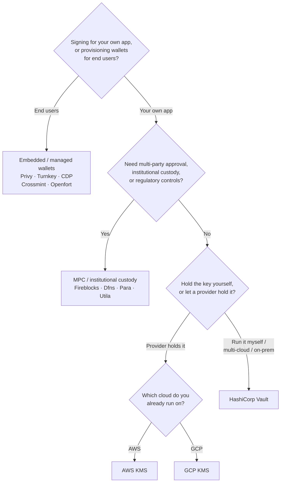

Keychainはすべてのバックエンドにわたって1つの`SolanaSigner`インターフェースを公開しているため、選択は設計上の問題ではなく運用上の問題です — 後から設定を変更することができます。そのため、**製品からではなく、要件から始めてください。**
ほとんどの場合、2つの問いで決まります:
_秘密鍵はどこに保管されるのか、そして誰がその鍵を使って署名を承認できるのか?_

最良のバックエンドは1つではありません。それぞれが特定の制約セットに適しています — すでに利用しているクラウド、鍵インフラを自社運用するかどうか、そして必要なカストディと承認制御の要件。以下のフローはそれらの制約をバックエンドに対応付けます。

<Callout type="info">
  このガイドはバックエンド（サーバーサイド）署名を対象としています。エンドユーザーがブラウザで自身のトランザクションに署名する場合は、代わりにWallet
  Standardを通じてウォレットを使用してください —
  [本番環境での署名](/docs/core/transactions/signing-in-production)を参照してください。
</Callout>

## 決定フロー

<Callout type="info">
  ローカル開発とテストにはこれらは不要です —
  プロトタイピングには**Memory**バックエンドを使用し、その後、設定を通じて上記の本番バックエンドのいずれかに切り替えてください。
</Callout>

## 各質問を確認する

<Steps>

<Step>

### 自社アプリケーションに署名していますか、それともエンドユーザーのために署名していますか？

**エンドユーザー**が所有・操作するウォレット（コンシューマーアプリ、オンボーディングフロー）をプロビジョニングする場合は、**組み込み／マネージドウォレット**バックエンドを使用してください —
Privy、Turnkey、CDP、Crossmint、またはOpenfort。これらはユーザーごとのウォレットと認証をお客様に代わって管理します。

**自身のアプリケーション**として署名する場合（手数料支払者、トレジャリー、バックエンド自動化など）は、このまま続けてください。

</Step>

<Step>

### マルチパーティ承認、機関向けカストディ、または規制上のコントロールが必要ですか？

署名を生成する前に承認ポリシー、支出制限、またはコンプライアンスワークフローをクリアする必要がある場合、あるいは規制を受けたカストディアンによる鍵の保管が必要な場合は、**MPC
/ 機関向けカストディ**バックエンドを使用してください：Fireblocks、Dfns、Para、または Utila。これらはポリシーに従って鍵を分割・保管し、共同署名を行います。

リクエストに応じて署名する鍵のみが必要な場合は、このまま続けてください。

</Step>

<Step>

### 鍵を自身で保持しますか、それともプロバイダーに保持させますか？

クラウドプロバイダーがハードウェアに裏付けられたインフラで鍵を保持し、IAM ポリシーで署名権限を管理する場合は、そのクラウドの KMS を使用してください：

- **AWS 上で実行** → AWS KMS
- **GCP 上で実行** → GCP KMS

鍵インフラを自身で運用したい場合、またはマルチクラウド環境やオンプレミス環境の場合は、**HashiCorp
Vault**
を使用してください。運用と監査はご自身で行い、鍵は Transit エンジン内に留まり、リクエストに応じて署名します。

</Step>

</Steps>

## カストディモデル

バックエンドは5つのカストディモデルに分類されます。上記のフローによっていずれかのモデルに該当します。

- **セルフカストディ（インプロセス）**
  — アプリケーションが生の秘密鍵を保持します。開発には便利ですが、本番環境には適していません。バックエンド：**Memory**。
- **セルフホスト型鍵管理**
  — 鍵インフラをご自身で運用し、鍵はその内部に留まりリクエストに応じて署名します。バックエンド：**HashiCorp
  Vault**。
- **クラウド KMS / HSM**
  — クラウドプロバイダーがハードウェアに裏付けられたインフラで鍵を保管し、鍵はサービスの外に出ることなく、IAM ポリシーによって署名権限が管理されます。バックエンド：**AWS
  KMS**、**GCP KMS**。
- **MPC & 機関向けカストディ**
  — 鍵はプロバイダーによって分割または保管され、ポリシー（承認、制限）に従って共同署名が行われます。バックエンド：**Fireblocks**、**Dfns**、**Para**、**Utila**。
- **組み込み型 & マネージドウォレット**
  — プロバイダーがお客様に代わってウォレットを管理します。主にエンドユーザーのオンボーディングを目的としています。バックエンド：**Privy**、**Turnkey**、**CDP**、**Crossmint**、**Openfort**。

## バックエンド比較

| バックエンド    | カストディモデル               | 最適な用途                                                       | 備考                                                         |
| --------------- | ------------------------------ | ---------------------------------------------------------------- | ------------------------------------------------------------ |
| Memory          | セルフカストディ（プロセス内） | ローカル開発、テスト、CI                                         | プロセス内に生の鍵が存在 — 本番環境での使用は不可            |
| HashiCorp Vault | セルフホスト型鍵管理           | 独自の鍵インフラを運用するチーム                                 | Transitエンジン；運用および監査はユーザー側で実施            |
| AWS KMS         | クラウドKMS / HSM              | AWSで稼働するバックエンド                                        | 鍵はKMSの外に出ない；IAMが署名を制御                         |
| GCP KMS         | クラウドKMS / HSM              | GCPで稼働するバックエンド                                        | 鍵はKMSの外に出ない；IAMが署名を制御                         |
| Fireblocks      | MPC／機関向けカストディ        | トレジャリー、取引所、規制対応カストディ                         | ポリシーエンジンおよび承認ワークフロー                       |
| Dfns            | MPCウォレットインフラ          | ポリシー制御付きのプログラマティックウォレット                   | Ed25519署名                                                  |
| Para            | MPCウォレット                  | MPCバックアップウォレットを必要とするアプリ                      | APIキー＋ウォレットID                                        |
| Utila           | MPCカストディ＋共同署名者      | 既存のUtila管理Solanaウォレット                                  | `signMessage` 非対応；txのブロードキャストはユーザー側で実施 |
| Privy           | 組み込みウォレット             | ウォレットへのユーザーオンボーディングを行うコンシューマーアプリ | アプリ管理の組み込みウォレット                               |
| Turnkey         | 非カストディ型鍵管理           | ポリシーゲート付きのプログラマティック署名                       | 非カストディ型鍵管理                                         |
| CDP             | 管理ウォレット（Coinbase）     | Coinbase開発者プラットフォーム上のアプリ                         | `signMessage` はUTF-8ペイロードのみ受付                      |
| Crossmint       | 管理ウォレット                 | マーケットプレイスおよび管理ウォレットアプリ                     | `smart` および `mpc` ウォレット；`signMessage` 非対応        |
| Openfort        | 組み込みバックエンドウォレット | サーバーサイドウォレット                                         | TEE保管鍵                                                    |

## エンタープライズシナリオ

単一のアプリケーションが、これらの機能を同時に複数必要とすることはよくあります。インターフェースが統一されているため、呼び出し箇所を変更することなく、ロールごとに異なるバックエンドを使用できます。

- **トレジャリー運用**
  — 運用用の「ホット」署名者とトレジャリー用の「コールド」署名者を分離します。トレジャリーはMPCカストディまたはクラウドHSMでバックアップし、高額署名の前に承認ポリシーを必須とします。
- **承認ワークフロー** —
  MPCおよびカストディバックエンド（Fireblocksなど）は、署名生成前にマルチパーティ承認を強制します。
- **コンプライアンスと監査**
  — クラウドKMS（AWS/GCP）およびVaultは署名監査ログを出力し、機関カストディアンはポリシー適用とレポーティングを追加します。
- **規制環境**
  — 鍵素材をHSM、KMS、または機関カストディアンに保管し、生の鍵がアプリケーションに触れないようにします。

これらのバックエンドを安全に運用するには、[本番環境のベストプラクティス](/docs/tools/keychain/production-best-practices)を参照してください。

<Cards>
  <Card title="Rustガイド" href="/docs/tools/keychain/getting-started/rust">
    Rustで各バックエンドを設定します。
  </Card>
  <Card
    title="TypeScriptガイド"
    href="/docs/tools/keychain/getting-started/typescript"
  >
    TypeScriptで各バックエンドを設定します。
  </Card>
</Cards>
