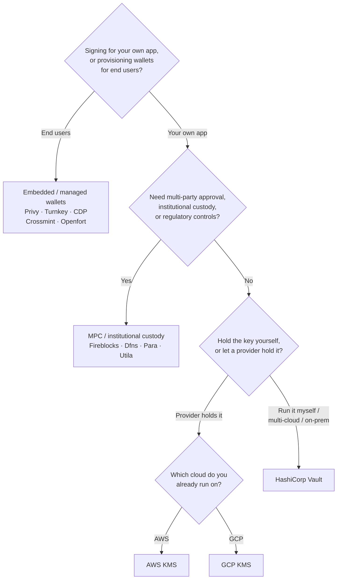

Keychain udostępnia jeden interfejs `SolanaSigner` dla każdego backendu, więc
wybór ma charakter operacyjny, a nie architektoniczny — możesz go zmienić
później poprzez konfigurację. Z tego względu **zacznij od swoich wymagań, nie od
produktu.** Dwie kwestie decydują o większości aspektów: _gdzie przechowywany
jest klucz prywatny i kto jest uprawniony do autoryzacji podpisu nim?_

Nie istnieje jeden najlepszy backend. Każdy z nich lepiej sprawdza się w
określonym zestawie ograniczeń — chmura, z której już korzystasz, to, czy chcesz
zarządzać infrastrukturą kluczy, oraz jakie kontrole przechowywania i
zatwierdzania są wymagane. Poniższy schemat mapuje te ograniczenia na konkretny
backend.

<Callout type="info">
  Ten przewodnik dotyczy podpisywania po stronie serwera (backend). Gdy Twoi
  użytkownicy końcowi podpisują własne transakcje w przeglądarce, użyj portfela
  poprzez Wallet Standard — zob. [Podpisywanie w
  produkcji](/docs/core/transactions/signing-in-production).
</Callout>

## Schemat decyzyjny

<Callout type="info">
  Lokalne środowisko deweloperskie i testy nie wymagają żadnego z powyższych —
  użyj backendu **Memory** do prototypowania, a następnie przejdź na jeden z
  powyższych backendów produkcyjnych poprzez konfigurację.
</Callout>

## Przejdź przez pytania

<Steps>

<Step>

### Czy podpisujesz dla własnej aplikacji, czy dla użytkowników końcowych?

Jeśli udostępniasz portfele, które **użytkownicy końcowi** posiadają i obsługują
(aplikacje konsumenckie, procesy onboardingu), użyj backendu **embedded /
managed wallet** — Privy, Turnkey, CDP, Crossmint lub Openfort. Zarządzają one
portfelami per użytkownik oraz uwierzytelnianiem w Twoim imieniu.

Jeśli podpisujesz jako **własna aplikacja** — płatnik opłat, skarbiec,
automatyzacja backendu — kontynuuj poniżej.

</Step>

<Step>

### Czy potrzebujesz wielostronnego zatwierdzania, instytucjonalnej opieki nad kluczami lub kontroli regulacyjnych?

Jeśli podpisy muszą przejść przez politykę zatwierdzeń, limit wydatków lub
przepływ zgodności zanim zostaną wygenerowane — albo potrzebujesz regulowanego
powiernika przechowującego klucze — użyj backendu **MPC / instytucjonalnej
opieki nad kluczami**: Fireblocks, Dfns, Para lub Utila. Rozdzielają one klucz
lub sprawują nad nim pieczę i współpodpisują zgodnie z Twoją polityką.

Jeśli potrzebujesz jedynie klucza podpisującego na żądanie, kontynuuj poniżej.

</Step>

<Step>

### Czy chcesz przechowywać klucz samodzielnie, czy powierzyć go dostawcy?

Jeśli dostawca chmury ma przechowywać klucz w infrastrukturze sprzętowej a Twoja
polityka IAM kontroluje, kto może podpisywać, użyj KMS tej chmury:

- **Działasz na AWS** → AWS KMS
- **Działasz na GCP** → GCP KMS

Jeśli chcesz samodzielnie zarządzać infrastrukturą kluczy — lub działasz w
środowisku wielo-chmurowym bądź on-prem — użyj **HashiCorp Vault**. Sam go
uruchamiasz i audytujesz; klucz pozostaje wewnątrz silnika Transit i podpisuje
na żądanie.

</Step>

</Steps>

## Modele przechowywania kluczy

Backendy grupują się w pięć modeli przechowywania kluczy. Powyższy przepływ
prowadzi Cię do jednego z nich.

- **Własna pieczą (w procesie)** — aplikacja przechowuje surowy klucz prywatny.
  Wygodne podczas developmentu, ale nieodpowiednie dla środowiska produkcyjnego.
  Backend: **Memory**.
- **Samodzielnie hostowane zarządzanie kluczami** — sam zarządzasz
  infrastrukturą kluczy; klucz pozostaje wewnątrz niej i podpisuje na żądanie.
  Backend: **HashiCorp Vault**.
- **Cloud KMS / HSM** — dostawca chmury przechowuje klucz w infrastrukturze
  sprzętowej; klucz nigdy nie opuszcza usługi, a Twoja polityka IAM kontroluje,
  kto może podpisywać. Backendy: **AWS KMS**, **GCP KMS**.
- **MPC i instytucjonalna opieka nad kluczami** — klucz jest rozdzielony lub
  powierzony dostawcy, który współpodpisuje zgodnie z Twoją polityką
  (zatwierdzenia, limity). Backendy: **Fireblocks**, **Dfns**, **Para**,
  **Utila**.
- **Portfele wbudowane i zarządzane** — dostawca zarządza portfelami w Twoim
  imieniu, często w celu wdrożenia użytkowników końcowych. Backendy: **Privy**,
  **Turnkey**, **CDP**, **Crossmint**, **Openfort**.

## Porównanie backendów

| Backend         | Model przechowywania kluczy            | Najlepszy dla                                                 | Uwagi                                                     |
| --------------- | -------------------------------------- | ------------------------------------------------------------- | --------------------------------------------------------- |
| Memory          | Własna opieka (w procesie)             | Lokalne środowisko deweloperskie, testy, CI                   | Klucz surowy w procesie — nie używać na produkcji         |
| HashiCorp Vault | Własne zarządzanie kluczami            | Zespoły prowadzące własną infrastrukturę kluczy               | Silnik Transit; sam go obsługujesz i audytujesz           |
| AWS KMS         | Chmurowy KMS / HSM                     | Backendy działające na AWS                                    | Klucz nigdy nie opuszcza KMS; IAM kontroluje podpisywanie |
| GCP KMS         | Chmurowy KMS / HSM                     | Backendy działające na GCP                                    | Klucz nigdy nie opuszcza KMS; IAM kontroluje podpisywanie |
| Fireblocks      | MPC / instytucjonalna opieka           | Skarbce, giełdy, regulowana opieka nad aktywami               | Silnik polityk i przepływy zatwierdzania                  |
| Dfns            | Infrastruktura portfeli MPC            | Portfele programistyczne z kontrolą polityk                   | Podpisywanie Ed25519                                      |
| Para            | Portfele MPC                           | Aplikacje wymagające portfeli opartych na MPC                 | Klucz API + ID portfela                                   |
| Utila           | Opieka MPC + współpodpisujący          | Istniejące portfele Solana zarządzane przez Utila             | `signMessage` nieobsługiwane; sam rozgłaszasz transakcję  |
| Privy           | Wbudowane portfele                     | Aplikacje konsumenckie wprowadzające użytkowników do portfeli | Wbudowane portfele zarządzane przez aplikację             |
| Turnkey         | Bezopiecznościowe zarządzanie kluczami | Programistyczne podpisywanie z kontrolą polityk               | Bezopiecznościowe zarządzanie kluczami                    |
| CDP             | Zarządzany portfel (Coinbase)          | Aplikacje na platformie Coinbase Developer Platform           | `signMessage` akceptuje wyłącznie dane UTF-8              |
| Crossmint       | Zarządzane portfele                    | Platformy marketplace i aplikacje z zarządzanymi portfelami   | Portfele `smart` i `mpc`; `signMessage` nieobsługiwane    |
| Openfort        | Wbudowane portfele backendowe          | Portfele po stronie serwera                                   | Klucze przechowywane w TEE                                |

## Scenariusze enterprise

Pojedyncza aplikacja często potrzebuje więcej niż jednego z tych rozwiązań
jednocześnie. Ponieważ interfejs jest identyczny, można uruchomić inny backend
dla każdej roli bez zmiany miejsc wywołań.

- **Operacje skarbcowe** — oddziel operacyjny podpisujący "hot" od "cold"
  podpisującego skarbca. Zabezpiecz skarbiec za pomocą MPC custody lub
  sprzętowego HSM w chmurze i wymagaj polityk zatwierdzania przed podpisami o
  wysokiej wartości.
- **Przepływy zatwierdzeń** — backendy MPC i custody (np. Fireblocks) wymuszają
  wielostronne zatwierdzenie przed wygenerowaniem podpisu.
- **Zgodność i audyt** — KMS w chmurze (AWS/GCP) oraz Vault generują dzienniki
  audytu podpisywania; instytucjonalni kustodowie dodają egzekwowanie polityk i
  raportowanie.
- **Środowiska regulowane** — przechowuj materiał klucza w HSM, KMS lub
  instytucjonalnym kustosze, aby surowe klucze nigdy nie miały kontaktu z Twoją
  aplikacją.

Zobacz
[Najlepsze praktyki produkcyjne](/docs/tools/keychain/production-best-practices)
aby bezpiecznie obsługiwać te backendy.

<Cards>
  <Card
    title="Przewodnik Rust"
    href="/docs/tools/keychain/getting-started/rust"
  >
    Skonfiguruj każdy backend w języku Rust.
  </Card>
  <Card
    title="Przewodnik TypeScript"
    href="/docs/tools/keychain/getting-started/typescript"
  >
    Skonfiguruj każdy backend w języku TypeScript.
  </Card>
</Cards>
