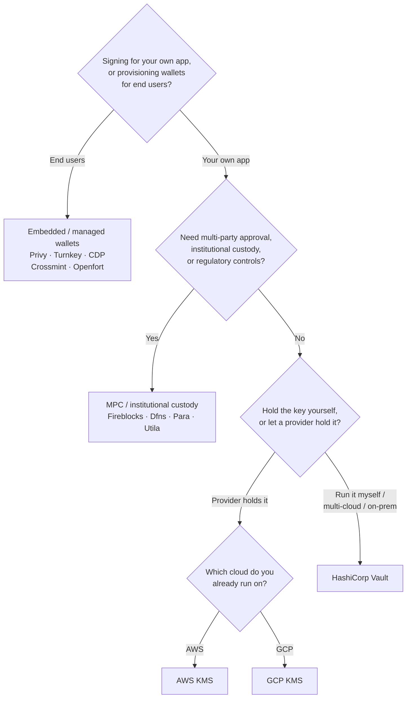

Keychain предоставляет единый интерфейс `SolanaSigner` для всех бэкендов,
поэтому выбор является операционным, а не архитектурным — вы можете изменить его
позже через конфигурацию. Исходя из этого, **отталкивайтесь от своих требований,
а не от продукта.** Два вопроса решают большинство задач: _где хранится
приватный ключ и кто вправе авторизовать подпись с его помощью?_

Не существует единого лучшего бэкенда. Каждый из них лучше подходит для
определённого набора ограничений — облако, которое вы уже используете, желание
самостоятельно управлять ключевой инфраструктурой, а также требования к хранению
ключей и контролю подтверждений. Приведённая ниже схема сопоставляет эти
ограничения с конкретным бэкендом.

<Callout type="info">
  Это руководство охватывает подписание на стороне сервера (бэкенд). Когда ваши
  конечные пользователи подписывают собственные транзакции в браузере,
  используйте кошелёк через Wallet Standard — см. [Подписание в
  продакшене](/docs/core/transactions/signing-in-production).
</Callout>

## Схема принятия решений

<Callout type="info">
  Для локальной разработки и тестов всё это не нужно — используйте бэкенд
  **Memory** для прототипирования, а затем переключитесь на один из
  производственных бэкендов выше через конфигурацию.
</Callout>

## Разбор вопросов

<Steps>

<Step>

### Вы подписываете транзакции для собственного приложения или для конечных пользователей?

Если вы создаёте кошельки, которыми **конечные пользователи** владеют и
управляют самостоятельно (потребительские приложения, процессы онбординга),
используйте бэкенд **встроенного / управляемого кошелька** — Privy, Turnkey,
CDP, Crossmint или Openfort. Они управляют кошельками и аутентификацией каждого
пользователя от вашего имени.

Если вы подписываете транзакции **от имени собственного приложения** — в роли
плательщика комиссий, казначейства или серверной автоматизации — продолжайте
ниже.

</Step>

<Step>

### Требуется ли вам многостороннее согласование, институциональное хранение ключей или соответствие нормативным требованиям?

Если подписи должны проходить через политику согласования, лимиты расходов или
процедуры соответствия требованиям до их формирования — либо вам необходим
регулируемый кастодиан для хранения ключей — используйте бэкенд **MPC /
институционального хранения**: Fireblocks, Dfns, Para или Utila. Они разделяют
ключ или берут его на хранение и совместно подписывают в соответствии с вашей
политикой.

Если вам нужен только ключ, подписывающий по запросу, продолжайте ниже.

</Step>

<Step>

### Вы хотите хранить ключ самостоятельно или доверить его провайдеру?

Если ключ должен храниться у облачного провайдера в аппаратно защищённой
инфраструктуре, а политика IAM контролирует права на подпись, используйте KMS
этого облака:

- **Работаете на AWS** → AWS KMS
- **Работаете на GCP** → GCP KMS

Если вы хотите управлять ключевой инфраструктурой самостоятельно — или
используете несколько облаков либо локальное развёртывание — используйте
**HashiCorp Vault**. Вы сами эксплуатируете и аудируете его; ключ остаётся
внутри движка Transit и подписывает по запросу.

</Step>

</Steps>

## Модели хранения ключей

Бэкенды делятся на пять моделей хранения ключей. Описанная выше схема приведёт
вас к одной из них.

- **Самостоятельное хранение (внутри процесса)** — приложение хранит приватный
  ключ напрямую. Удобно для разработки, но не подходит для производственной
  среды. Бэкенд: **Memory**.
- **Самостоятельно управляемое хранилище ключей** — вы управляете ключевой
  инфраструктурой; ключ остаётся внутри неё и подписывает по запросу. Бэкенд:
  **HashiCorp Vault**.
- **Cloud KMS / HSM** — облачный провайдер хранит ключ в аппаратно защищённой
  инфраструктуре; ключ никогда не покидает сервис, а политика IAM контролирует
  права на подпись. Бэкенды: **AWS KMS**, **GCP KMS**.
- **MPC и институциональное хранение** — ключ разделён или передан на хранение
  провайдеру, который совместно подписывает в соответствии с вашей политикой
  (согласования, лимиты). Бэкенды: **Fireblocks**, **Dfns**, **Para**,
  **Utila**.
- **Встроенные и управляемые кошельки** — провайдер управляет кошельками от
  вашего имени, зачастую для подключения конечных пользователей. Бэкенды:
  **Privy**, **Turnkey**, **CDP**, **Crossmint**, **Openfort**.

## Сравнение бэкендов

| Бэкенд          | Модель хранения                       | Лучше всего подходит для                                             | Примечания                                                  |
| --------------- | ------------------------------------- | -------------------------------------------------------------------- | ----------------------------------------------------------- |
| Memory          | Самостоятельное хранение (в процессе) | Локальная разработка, тесты, CI                                      | Открытый ключ в процессе — не использовать в продакшене     |
| HashiCorp Vault | Самостоятельное управление ключами    | Команды, использующие собственную ключевую инфраструктуру            | Transit engine; вы сами управляете и проводите аудит        |
| AWS KMS         | Облачный KMS / HSM                    | Бэкенды, работающие на AWS                                           | Ключ никогда не покидает KMS; IAM управляет подписанием     |
| GCP KMS         | Облачный KMS / HSM                    | Бэкенды, работающие на GCP                                           | Ключ никогда не покидает KMS; IAM управляет подписанием     |
| Fireblocks      | MPC / институциональное хранение      | Казначейства, биржи, регулируемое хранение                           | Движок политик и процессы согласования                      |
| Dfns            | MPC-инфраструктура кошельков          | Программные кошельки с управлением политиками                        | Подписание Ed25519                                          |
| Para            | MPC-кошельки                          | Приложения с MPC-кошельками                                          | API-ключ + идентификатор кошелька                           |
| Utila           | MPC-хранение + ко-подписант           | Существующие кошельки Solana под управлением Utila                   | `signMessage` не поддерживается; вы транслируете транзакцию |
| Privy           | Встроенные кошельки                   | Потребительские приложения для подключения пользователей к кошелькам | Встроенные кошельки под управлением приложения              |
| Turnkey         | Некастодиальное управление ключами    | Программное подписание с контролем политик                           | Некастодиальное управление ключами                          |
| CDP             | Управляемый кошелёк (Coinbase)        | Приложения на платформе Coinbase Developer Platform                  | `signMessage` принимает только UTF-8 payload                |
| Crossmint       | Управляемые кошельки                  | Маркетплейсы и приложения с управляемыми кошельками                  | Кошельки `smart` и `mpc`; `signMessage` не поддерживается   |
| Openfort        | Встроенные серверные кошельки         | Серверные кошельки                                                   | Ключи хранятся в TEE                                        |

## Корпоративные сценарии

Одному приложению нередко требуется сразу несколько из перечисленных
возможностей. Поскольку интерфейс идентичен, вы можете использовать разные
бэкенды для каждой роли, не изменяя места вызовов.

- **Операции казначейства** — разделите операционный «горячий» подписант и
  «холодный» казначейский подписант. Подключите казначейство к MPC-хранилищу или
  облачному HSM и настройте политики подтверждения перед подписанием транзакций
  высокой стоимости.
- **Процессы согласования** — бэкенды MPC и хранилищ (например, Fireblocks)
  обеспечивают многостороннее согласование до формирования подписи.
- **Соответствие требованиям и аудит** — облачные KMS (AWS/GCP) и Vault ведут
  журналы аудита подписания; институциональные кастодианы добавляют применение
  политик и отчётность.
- **Регулируемые среды** — храните ключевой материал в HSM, KMS или
  институциональном кастодиане, чтобы исходные ключи никогда не попадали в ваше
  приложение.

См.
[Рекомендации для продакшена](/docs/tools/keychain/production-best-practices) по
безопасной эксплуатации этих бэкендов.

<Cards>
  <Card
    title="Руководство для Rust"
    href="/docs/tools/keychain/getting-started/rust"
  >
    Настройка каждого бэкенда на Rust.
  </Card>
  <Card
    title="Руководство для TypeScript"
    href="/docs/tools/keychain/getting-started/typescript"
  >
    Настройка каждого бэкенда на TypeScript.
  </Card>
</Cards>
