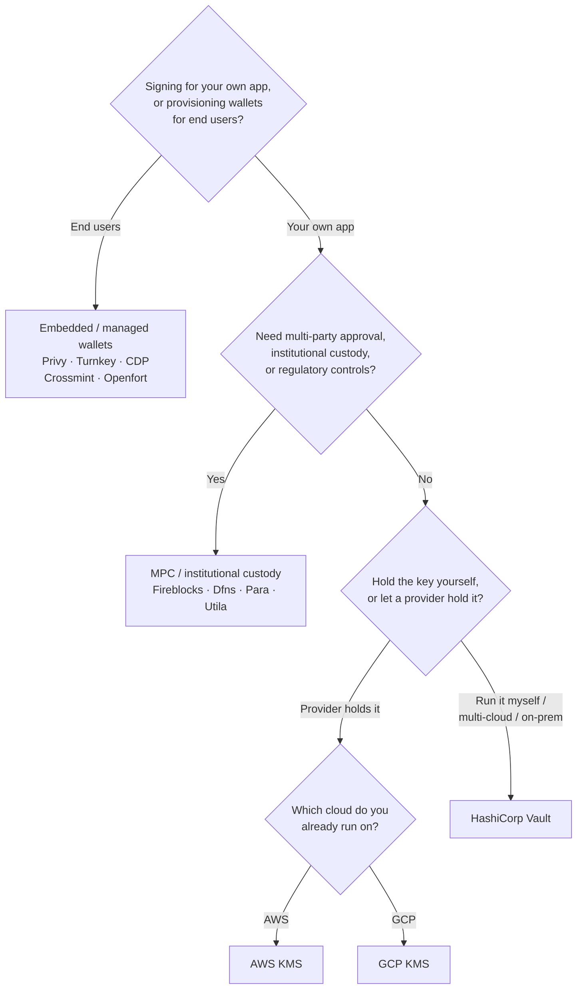

Keychain, her backend genelinde tek bir `SolanaSigner` arayüzü sunar; bu nedenle
seçim mimari değil, operasyonel bir karardır — yapılandırma yoluyla daha sonra
değiştirebilirsiniz. Bu nedenle, **bir üründen değil, gereksinimlerinizden
başlayın.** Bunu belirleyen iki temel soru vardır: _özel anahtar nerede tutulur
ve onu kullanarak imza yetkilendirmesine kimin izni vardır?_

Tek bir en iyi backend yoktur. Her biri belirli kısıtlamalar için daha uygundur
— halihazırda kullandığınız bulut platformu, anahtar altyapısı işletmek isteyip
istemediğiniz ve sahip olmanız gereken gözetim ile onay kontrolleri. Aşağıdaki
akış, bu kısıtlamaları bir backend'e eşler.

<Callout type="info">
  Bu kılavuz backend (sunucu tarafı) imzalamayı kapsar. Son kullanıcılarınız
  kendi işlemlerini bir tarayıcıda imzaladığında, bunun yerine Wallet Standard
  aracılığıyla bir cüzdan kullanın — bkz. [Üretimde
  İmzalama](/docs/core/transactions/signing-in-production).
</Callout>

## Karar akışı

<Callout type="info">
  Yerel geliştirme ve testler bunların hiçbirine ihtiyaç duymaz — prototipleme
  için **Memory** backend'ini kullanın, ardından yapılandırma yoluyla yukarıdaki
  üretim backend'lerinden birine geçin.
</Callout>

## Soruları inceleyin

<Steps>

<Step>

### Kendi uygulamanız için mi, yoksa son kullanıcılarınız için mi imzalıyorsunuz?

**Son kullanıcıların** sahip olduğu ve yönettiği cüzdanlar sağlıyorsanız
(tüketici uygulamaları, kayıt akışları), **gömülü / yönetilen cüzdan** backend'i
kullanın — Privy, Turnkey, CDP, Crossmint veya Openfort. Bunlar, kullanıcı
başına cüzdan yönetimini ve kimlik doğrulamayı sizin adınıza gerçekleştirir.

**Kendi uygulamanız** adına imzalıyorsanız — ücret ödeyici, hazine, arka uç
otomasyonu — aşağıdan devam edin.

</Step>

<Step>

### Çok taraflı onay, kurumsal saklama veya düzenleyici kontrollere ihtiyacınız var mı?

İmzalar üretilmeden önce bir onay politikasını, harcama limitini veya uyumluluk
iş akışını geçmesi gerekiyorsa — ya da anahtarları tutan düzenlenmiş bir
saklayıcıya ihtiyacınız varsa — **MPC / kurumsal saklama** arka ucunu kullanın:
Fireblocks, Dfns, Para veya Utila. Bunlar anahtarı böler veya saklar ve
politikanıza göre ortak imzalar.

Yalnızca istek üzerine imzalayan bir anahtara ihtiyacınız varsa aşağıdan devam
edin.

</Step>

<Step>

### Anahtarı kendiniz mi tutmak istiyorsunuz, yoksa bir sağlayıcı mı tutsun?

Bir bulut sağlayıcısının anahtarı donanım destekli altyapıda tutmasını ve IAM
politikanızın kimlerin imzalayabileceğini kontrol etmesini istiyorsanız o
bulutun KMS'ini kullanın:

- **AWS üzerinde çalışıyorsanız** → AWS KMS
- **GCP üzerinde çalışıyorsanız** → GCP KMS

Anahtar altyapısını kendiniz işletmek istiyorsanız — ya da çoklu bulut veya
yerel ortam kullanıyorsanız — **HashiCorp Vault** kullanın. Onu siz çalıştırır
ve denetlersiniz; anahtar Transit motorunun içinde kalır ve istek üzerine
imzalar.

</Step>

</Steps>

## Saklama modelleri

Arka uçlar beş saklama modeli altında gruplandırılır. Yukarıdaki akış sizi
bunlardan birine yönlendirir.

- **Öz-saklama (süreç içi)** — uygulamanız ham özel anahtarı tutar. Geliştirme
  için kullanışlıdır, ancak üretim için uygun değildir. Arka uç: **Memory**.
- **Kendi kendine barındırılan anahtar yönetimi** — anahtar altyapısını siz
  işletirsiniz; anahtar içinde kalır ve istek üzerine imzalar. Arka uç:
  **HashiCorp Vault**.
- **Bulut KMS / HSM** — bir bulut sağlayıcısı anahtarı donanım destekli
  altyapıda saklar; anahtar hizmeti asla terk etmez ve IAM politikanız kimlerin
  imzalayabileceğini kontrol eder. Arka uçlar: **AWS KMS**, **GCP KMS**.
- **MPC ve kurumsal saklama** — anahtar bir sağlayıcı genelinde bölünür veya
  saklanır; sağlayıcı politikanıza göre (onaylar, limitler) ortak imzalar. Arka
  uçlar: **Fireblocks**, **Dfns**, **Para**, **Utila**.
- **Gömülü ve yönetilen cüzdanlar** — bir sağlayıcı genellikle son kullanıcıları
  dahil etmek amacıyla cüzdanları sizin adınıza yönetir. Arka uçlar: **Privy**,
  **Turnkey**, **CDP**, **Crossmint**, **Openfort**.

## Backend karşılaştırması

| Backend         | Saklama modeli                      | En uygun kullanım                                         | Notlar                                                       |
| --------------- | ----------------------------------- | --------------------------------------------------------- | ------------------------------------------------------------ |
| Memory          | Öz-saklama (işlem içi)              | Yerel geliştirme, testler, CI                             | Ham anahtar işlem içinde — üretimde kullanmayın              |
| HashiCorp Vault | Kendi barındırılan anahtar yönetimi | Kendi anahtar altyapısını işleten ekipler                 | Transit motoru; siz işletir ve denetlersiniz                 |
| AWS KMS         | Bulut KMS / HSM                     | AWS üzerinde çalışan backend'ler                          | Anahtar hiçbir zaman KMS'den çıkmaz; IAM imzalamayı denetler |
| GCP KMS         | Bulut KMS / HSM                     | GCP üzerinde çalışan backend'ler                          | Anahtar hiçbir zaman KMS'den çıkmaz; IAM imzalamayı denetler |
| Fireblocks      | MPC / kurumsal saklama              | Hazineler, borsalar, düzenlenmiş saklama                  | Politika motoru ve onay iş akışları                          |
| Dfns            | MPC cüzdan altyapısı                | Politika kontrollü programatik cüzdanlar                  | Ed25519 imzalama                                             |
| Para            | MPC cüzdanlar                       | MPC destekli cüzdan isteyen uygulamalar                   | API anahtarı + cüzdan kimliği                                |
| Utila           | MPC saklama + ortak imzalayıcı      | Mevcut Utila yönetimli Solana cüzdanları                  | `signMessage` desteklenmiyor; işlemi siz yayınlarsınız       |
| Privy           | Gömülü cüzdanlar                    | Kullanıcıları cüzdanlara dahil eden tüketici uygulamaları | Uygulama tarafından yönetilen gömülü cüzdanlar               |
| Turnkey         | Emanetsiz anahtar yönetimi          | Programatik, politika kapılı imzalama                     | Emanetsiz anahtar yönetimi                                   |
| CDP             | Yönetilen cüzdan (Coinbase)         | Coinbase Developer Platform üzerindeki uygulamalar        | `signMessage` yalnızca UTF-8 yüklerini kabul eder            |
| Crossmint       | Yönetilen cüzdanlar                 | Pazaryerleri ve yönetilen cüzdan uygulamaları             | `smart` ve `mpc` cüzdanlar; `signMessage` desteklenmiyor     |
| Openfort        | Gömülü backend cüzdanları           | Sunucu taraflı cüzdanlar                                  | TEE'de depolanan anahtarlar                                  |

## Kurumsal senaryolar

Tek bir uygulama genellikle aynı anda bunların birden fazlasına ihtiyaç duyar.
Arayüz aynı olduğundan, çağrı noktalarını değiştirmeden her rol için farklı bir
arka uç çalıştırabilirsiniz.

- **Hazine işlemleri** — operasyonel bir "sıcak" imzacıyı "soğuk" bir hazine
  imzacısından ayırın. Hazineyi MPC saklama veya bir bulut HSM ile destekleyin
  ve yüksek değerli imzalar öncesinde onay politikaları zorunlu kılın.
- **Onay iş akışları** — MPC ve saklama arka uçları (ör. Fireblocks), imza
  üretilmeden önce çok taraflı onayı zorunlu kılar.
- **Uyumluluk ve denetim** — bulut KMS (AWS/GCP) ve Vault, imzalama denetim
  günlükleri yayar; kurumsal saklama sağlayıcıları politika uygulama ve
  raporlama ekler.
- **Düzenlenmiş ortamlar** — ham anahtarlar uygulamanıza hiçbir zaman
  dokunmayacak şekilde anahtar materyalini bir HSM, KMS veya kurumsal saklama
  sağlayıcısında tutun.

Bu arka uçları güvenli şekilde işletmek için
[Üretim en iyi uygulamaları](/docs/tools/keychain/production-best-practices)
sayfasına bakın.

<Cards>
  <Card title="Rust rehberi" href="/docs/tools/keychain/getting-started/rust">
    Her arka ucu Rust'ta yapılandırın.
  </Card>
  <Card
    title="TypeScript rehberi"
    href="/docs/tools/keychain/getting-started/typescript"
  >
    Her arka ucu TypeScript'te yapılandırın.
  </Card>
</Cards>
