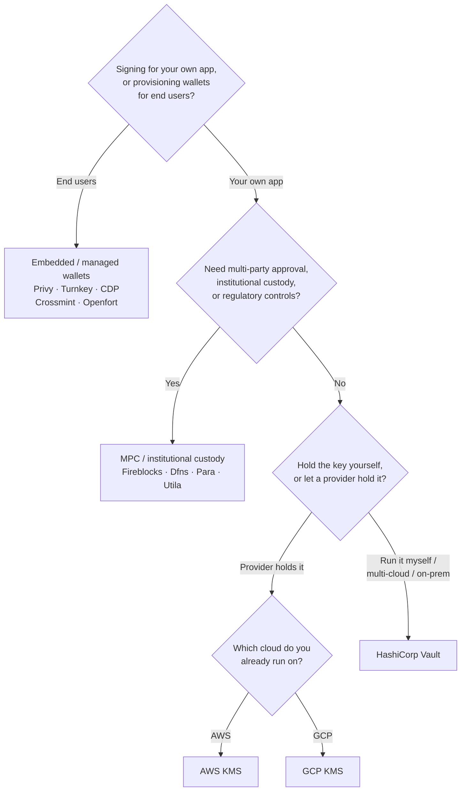

Keychain надає єдиний інтерфейс `SolanaSigner` для кожного бекенду, тому вибір є
операційним, а не архітектурним — ви можете змінити його пізніше через
конфігурацію. Тому **починайте з ваших вимог, а не з продукту.** Два питання
вирішують більшість: _де зберігається приватний ключ і хто має право
авторизувати підпис ним?_

Не існує єдиного найкращого бекенду. Кожен краще підходить для певного набору
обмежень — хмара, яку ви вже використовуєте, готовність підтримувати ключову
інфраструктуру, а також необхідні вам засоби зберігання та контролю авторизації.
Наведена нижче схема відображає ці обмеження на відповідний бекенд.

<Callout type="info">
  Цей посібник охоплює підписання на стороні сервера (бекенд). Якщо ваші кінцеві
  користувачі підписують власні транзакції у браузері, використовуйте гаманець
  через Wallet Standard — див. [Підписання в
  продакшені](/docs/core/transactions/signing-in-production).
</Callout>

## Схема прийняття рішень

<Callout type="info">
  Для локальної розробки та тестування нічого з цього не потрібно —
  використовуйте бекенд **Memory** для прототипування, а потім перейдіть на один
  із наведених вище продакшн-бекендів через конфігурацію.
</Callout>

## Розбір питань

<Steps>

<Step>

### Ви підписуєте для власного застосунку чи для кінцевих користувачів?

Якщо ви надаєте гаманці, якими **кінцеві користувачі** володіють і керують
(споживацькі застосунки, процеси онбордингу), використовуйте бекенд
**вбудованого / керованого гаманця** — Privy, Turnkey, CDP, Crossmint або
Openfort. Вони керують гаманцями та аутентифікацією для кожного користувача від
вашого імені.

Якщо ви підписуєте як **власний застосунок** — платник комісії, скарбниця,
бекенд-автоматизація — продовжуйте нижче.

</Step>

<Step>

### Чи потрібне вам багатостороннє погодження, інституційне зберігання або регуляторний контроль?

Якщо підписи повинні пройти через політику погодження, ліміт витрат або
відповідний робочий процес перед тим, як будуть сформовані — або вам потрібен
регульований зберігач ключів — використовуйте бекенд **MPC / інституційного
зберігання**: Fireblocks, Dfns, Para або Utila. Вони розподіляють або зберігають
ключ і підписують спільно відповідно до вашої політики.

Якщо вам потрібен лише ключ, що підписує за запитом, продовжуйте нижче.

</Step>

<Step>

### Ви хочете зберігати ключ самостійно чи довірити це провайдеру?

Якщо хмарний провайдер повинен зберігати ключ в апаратній інфраструктурі, а ваша
політика IAM контролює, хто може підписувати, — використовуйте KMS цього
хмарного провайдера:

- **Розгортання на AWS** → AWS KMS
- **Розгортання на GCP** → GCP KMS

Якщо ви хочете самостійно керувати ключовою інфраструктурою — або використовуєте
мультихмарне чи локальне розгортання — використовуйте **HashiCorp Vault**. Ви
самостійно запускаєте та аудитуєте його; ключ зберігається всередині рушія
Transit і підписує за запитом.

</Step>

</Steps>

## Моделі зберігання

Бекенди поділяються на п'ять моделей зберігання. Описаний вище процес приведе
вас до однієї з них.

- **Самостійне зберігання (у процесі)** — ваш застосунок зберігає приватний ключ
  безпосередньо. Зручно для розробки, але не підходить для продакшену. Бекенд:
  **Memory**.
- **Самостійно розгорнуте управління ключами** — ви керуєте ключовою
  інфраструктурою; ключ зберігається всередині неї та підписує за запитом.
  Бекенд: **HashiCorp Vault**.
- **Хмарний KMS / HSM** — хмарний провайдер зберігає ключ в апаратній
  інфраструктурі; ключ ніколи не залишає сервіс, а ваша політика IAM контролює,
  хто може підписувати. Бекенди: **AWS KMS**, **GCP KMS**.
- **MPC та інституційне зберігання** — ключ розподілено або передано на
  зберігання провайдеру, який підписує спільно відповідно до вашої політики
  (погодження, ліміти). Бекенди: **Fireblocks**, **Dfns**, **Para**, **Utila**.
- **Вбудовані та керовані гаманці** — провайдер керує гаманцями від вашого
  імені, часто для залучення кінцевих користувачів. Бекенди: **Privy**,
  **Turnkey**, **CDP**, **Crossmint**, **Openfort**.

## Порівняння бекендів

| Бекенд          | Модель зберігання                 | Найкраще для                                                 | Примітки                                                 |
| --------------- | --------------------------------- | ------------------------------------------------------------ | -------------------------------------------------------- |
| Memory          | Самостійне зберігання (у процесі) | Локальна розробка, тести, CI                                 | Відкритий ключ у процесі — не використовуйте у продакшні |
| HashiCorp Vault | Власна система управління ключами | Команди з власною інфраструктурою ключів                     | Двигун Transit; ви самостійно керуєте та аудитуєте       |
| AWS KMS         | Хмарний KMS / HSM                 | Бекенди на AWS                                               | Ключ ніколи не покидає KMS; IAM контролює підписання     |
| GCP KMS         | Хмарний KMS / HSM                 | Бекенди на GCP                                               | Ключ ніколи не покидає KMS; IAM контролює підписання     |
| Fireblocks      | MPC / інституційне зберігання     | Скарбниці, біржі, регульоване зберігання                     | Рушій політик та процеси затвердження                    |
| Dfns            | MPC-інфраструктура гаманців       | Програмні гаманці з контролем політик                        | Підписання Ed25519                                       |
| Para            | MPC-гаманці                       | Застосунки з MPC-гаманцями                                   | API-ключ + ID гаманця                                    |
| Utila           | MPC-зберігання + ко-підписант     | Наявні Solana-гаманці під управлінням Utila                  | `signMessage` не підтримується; ви транслюєте транзакцію |
| Privy           | Вбудовані гаманці                 | Споживчі застосунки для підключення користувачів до гаманців | Вбудовані гаманці під управлінням застосунку             |
| Turnkey         | Некастодіальне управління ключами | Програмне підписання з контролем політик                     | Некастодіальне управління ключами                        |
| CDP             | Керований гаманець (Coinbase)     | Застосунки на Coinbase Developer Platform                    | `signMessage` приймає лише UTF-8 навантаження            |
| Crossmint       | Керовані гаманці                  | Маркетплейси та застосунки з керованими гаманцями            | Гаманці `smart` та `mpc`; `signMessage` не підтримується |
| Openfort        | Вбудовані бекенд-гаманці          | Гаманці на стороні сервера                                   | Ключі зберігаються у TEE                                 |

## Корпоративні сценарії

Один застосунок часто потребує кількох із них одночасно. Оскільки інтерфейс
ідентичний, можна використовувати різні бекенди для кожної ролі, не змінюючи
місця викликів.

- **Операції з казначейством** — розділіть операційний «гарячий» підписант від
  «холодного» казначейського підписанта. Підкріпіть казначейство MPC-зберіганням
  або хмарним HSM і вимагайте політик погодження перед підписанням транзакцій із
  високою вартістю.
- **Процеси погодження** — бекенди MPC та зберігача (наприклад, Fireblocks)
  забезпечують багатосторонне погодження перед створенням підпису.
- **Відповідність вимогам і аудит** — хмарний KMS (AWS/GCP) та Vault формують
  журнали аудиту підписань; інституційні зберігачі додають виконання політик і
  звітність.
- **Регульовані середовища** — зберігайте ключовий матеріал в HSM, KMS або
  інституційного зберігача, щоб необроблені ключі ніколи не торкалися вашого
  застосунку.

Дивіться
[Найкращі практики для продакшну](/docs/tools/keychain/production-best-practices)
для безпечної роботи з цими бекендами.

<Cards>
  <Card
    title="Посібник з Rust"
    href="/docs/tools/keychain/getting-started/rust"
  >
    Налаштуйте кожен бекенд у Rust.
  </Card>
  <Card
    title="Посібник з TypeScript"
    href="/docs/tools/keychain/getting-started/typescript"
  >
    Налаштуйте кожен бекенд у TypeScript.
  </Card>
</Cards>
