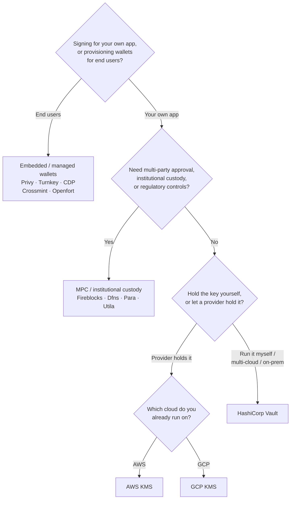

Keychain cung cấp một giao diện `SolanaSigner` thống nhất cho mọi backend, vì
vậy việc lựa chọn mang tính vận hành, không phải kiến trúc — bạn có thể thay đổi
sau thông qua cấu hình. Vì vậy, **hãy bắt đầu từ yêu cầu của bạn, không phải từ
một sản phẩm cụ thể.** Hai câu hỏi quyết định phần lớn: _khóa riêng tư được lưu
ở đâu, và ai được phép ủy quyền chữ ký với nó?_

Không có backend nào là tốt nhất tuyệt đối. Mỗi backend phù hợp hơn với một tập
hợp ràng buộc cụ thể — nền tảng đám mây bạn đang sử dụng, việc bạn có muốn tự
vận hành hạ tầng khóa hay không, và các yêu cầu về quyền giám sát và kiểm soát
phê duyệt mà bạn cần đáp ứng. Luồng dưới đây ánh xạ các ràng buộc đó tới một
backend.

<Callout type="info">
  Hướng dẫn này đề cập đến việc ký phía backend (phía máy chủ). Khi người dùng
  cuối ký các giao dịch của họ trên trình duyệt, hãy sử dụng ví thông qua Wallet
  Standard — xem [Ký trong Môi trường
  Production](/docs/core/transactions/signing-in-production).
</Callout>

## Luồng quyết định

<Callout type="info">
  Phát triển cục bộ và kiểm thử không cần bất kỳ điều nào trong số này — hãy sử
  dụng backend **Memory** để tạo nguyên mẫu, sau đó chuyển sang một trong các
  backend production ở trên thông qua cấu hình.
</Callout>

## Xem xét từng câu hỏi

<Steps>

<Step>

### Bạn đang ký cho ứng dụng của chính mình, hay cho người dùng cuối?

Nếu bạn cung cấp các ví mà **người dùng cuối** sở hữu và vận hành (ứng dụng tiêu
dùng, luồng onboarding), hãy sử dụng backend **ví nhúng / ví được quản lý** —
Privy, Turnkey, CDP, Crossmint, hoặc Openfort. Các dịch vụ này quản lý ví theo
từng người dùng và xác thực thay mặt bạn.

Nếu bạn đang ký với tư cách là **ứng dụng của chính mình** — người trả phí, kho
bạc, tự động hóa phụ trợ — hãy tiếp tục bên dưới.

</Step>

<Step>

### Bạn có cần phê duyệt đa bên, lưu ký tổ chức hay kiểm soát tuân thủ không?

Nếu chữ ký phải được thông qua chính sách phê duyệt, giới hạn chi tiêu hoặc quy
trình tuân thủ trước khi được tạo ra — hoặc bạn cần một đơn vị lưu ký được quản
lý nắm giữ khóa — hãy sử dụng phụ trợ **MPC / lưu ký tổ chức**: Fireblocks,
Dfns, Para hoặc Utila. Các giải pháp này phân tách hoặc lưu ký khóa và đồng ký
theo chính sách của bạn.

Nếu bạn chỉ cần một khóa ký theo yêu cầu, hãy tiếp tục bên dưới.

</Step>

<Step>

### Bạn muốn tự giữ khóa, hay để nhà cung cấp giữ hộ?

Nếu nhà cung cấp đám mây nên giữ khóa trong cơ sở hạ tầng được hỗ trợ bởi phần
cứng và chính sách IAM của bạn kiểm soát ai có thể ký, hãy sử dụng KMS của đám
mây đó:

- **Chạy trên AWS** → AWS KMS
- **Chạy trên GCP** → GCP KMS

Nếu bạn muốn tự vận hành cơ sở hạ tầng khóa — hoặc bạn đang dùng đa đám mây hay
triển khai on-prem — hãy sử dụng **HashiCorp Vault**. Bạn tự vận hành và kiểm
toán; khóa được lưu trong Transit engine và ký theo yêu cầu.

</Step>

</Steps>

## Các mô hình lưu ký

Các phụ trợ được nhóm thành năm mô hình lưu ký. Luồng trên sẽ đưa bạn vào một
trong số đó.

- **Tự lưu ký (trong tiến trình)** — ứng dụng của bạn giữ khóa riêng tư thô.
  Tiện lợi cho phát triển, nhưng không phù hợp cho môi trường sản xuất. Phụ trợ:
  **Memory**.
- **Quản lý khóa tự lưu trữ** — bạn tự vận hành cơ sở hạ tầng khóa; khóa được
  lưu bên trong và ký theo yêu cầu. Phụ trợ: **HashiCorp Vault**.
- **Cloud KMS / HSM** — nhà cung cấp đám mây lưu trữ khóa trong cơ sở hạ tầng
  được hỗ trợ bởi phần cứng; khóa không bao giờ rời khỏi dịch vụ và chính sách
  IAM của bạn kiểm soát ai có thể ký. Phụ trợ: **AWS KMS**, **GCP KMS**.
- **MPC & lưu ký tổ chức** — khóa được phân tách hoặc lưu ký qua một nhà cung
  cấp, đơn vị này đồng ký theo chính sách của bạn (phê duyệt, giới hạn). Phụ
  trợ: **Fireblocks**, **Dfns**, **Para**, **Utila**.
- **Ví nhúng & được quản lý** — nhà cung cấp quản lý ví thay mặt bạn, thường để
  giúp người dùng cuối dễ dàng tham gia. Phụ trợ: **Privy**, **Turnkey**,
  **CDP**, **Crossmint**, **Openfort**.

## So sánh Backend

| Backend         | Mô hình lưu ký               | Phù hợp nhất cho                                     | Ghi chú                                                            |
| --------------- | ---------------------------- | ---------------------------------------------------- | ------------------------------------------------------------------ |
| Memory          | Tự lưu ký (trong tiến trình) | Phát triển cục bộ, kiểm thử, CI                      | Khóa thô trong tiến trình — không dùng trong môi trường production |
| HashiCorp Vault | Quản lý khóa tự lưu trữ      | Các nhóm vận hành hạ tầng khóa riêng                 | Transit engine; bạn tự vận hành và kiểm toán                       |
| AWS KMS         | Cloud KMS / HSM              | Backend chạy trên AWS                                | Khóa không bao giờ rời KMS; IAM kiểm soát việc ký                  |
| GCP KMS         | Cloud KMS / HSM              | Backend chạy trên GCP                                | Khóa không bao giờ rời KMS; IAM kiểm soát việc ký                  |
| Fireblocks      | MPC / lưu ký tổ chức         | Quỹ bạc, sàn giao dịch, lưu ký có quy định           | Policy engine và quy trình phê duyệt                               |
| Dfns            | Hạ tầng ví MPC               | Ví lập trình với kiểm soát chính sách                | Ký Ed25519                                                         |
| Para            | Ví MPC                       | Ứng dụng muốn ví được hỗ trợ bởi MPC                 | API key + wallet ID                                                |
| Utila           | Lưu ký MPC + đồng ký         | Ví Solana hiện có được quản lý bởi Utila             | `signMessage` không được hỗ trợ; bạn tự broadcast tx               |
| Privy           | Ví nhúng                     | Ứng dụng tiêu dùng giúp người dùng onboarding vào ví | Ví nhúng do ứng dụng quản lý                                       |
| Turnkey         | Quản lý khóa phi lưu ký      | Ký lập trình, có kiểm soát chính sách                | Quản lý khóa phi lưu ký                                            |
| CDP             | Ví được quản lý (Coinbase)   | Ứng dụng trên Coinbase Developer Platform            | `signMessage` chỉ chấp nhận payload UTF-8                          |
| Crossmint       | Ví được quản lý              | Marketplace và ứng dụng ví được quản lý              | Ví `smart` và `mpc`; `signMessage` không được hỗ trợ               |
| Openfort        | Ví backend nhúng             | Ví phía server                                       | Khóa lưu trữ trong TEE                                             |

## Các kịch bản doanh nghiệp

Một ứng dụng duy nhất thường cần nhiều hơn một trong số các tính năng này cùng
một lúc. Vì giao diện là giống hệt nhau, bạn có thể chạy một backend khác nhau
cho mỗi vai trò mà không cần thay đổi các điểm gọi.

- **Hoạt động ngân quỹ** — tách biệt bộ ký "nóng" cho hoạt động vận hành khỏi bộ
  ký "lạnh" cho ngân quỹ. Hỗ trợ ngân quỹ bằng MPC custody hoặc cloud HSM và yêu
  cầu chính sách phê duyệt trước khi thực hiện các chữ ký có giá trị cao.
- **Quy trình phê duyệt** — các backend MPC và custody (ví dụ: Fireblocks) thực
  thi phê duyệt đa bên trước khi tạo chữ ký.
- **Tuân thủ và kiểm toán** — cloud KMS (AWS/GCP) và Vault phát sinh nhật ký
  kiểm toán ký; các tổ chức lưu ký thêm tính năng thực thi chính sách và báo
  cáo.
- **Môi trường được quản lý** — giữ tài liệu khóa trong HSM, KMS, hoặc tổ chức
  lưu ký để khóa thô không bao giờ tiếp xúc với ứng dụng của bạn.

Xem
[Các phương pháp tốt nhất cho môi trường sản xuất](/docs/tools/keychain/production-best-practices)
để vận hành các backend này một cách an toàn.

<Cards>
  <Card title="Hướng dẫn Rust" href="/docs/tools/keychain/getting-started/rust">
    Cấu hình từng backend trong Rust.
  </Card>
  <Card
    title="Hướng dẫn TypeScript"
    href="/docs/tools/keychain/getting-started/typescript"
  >
    Cấu hình từng backend trong TypeScript.
  </Card>
</Cards>
