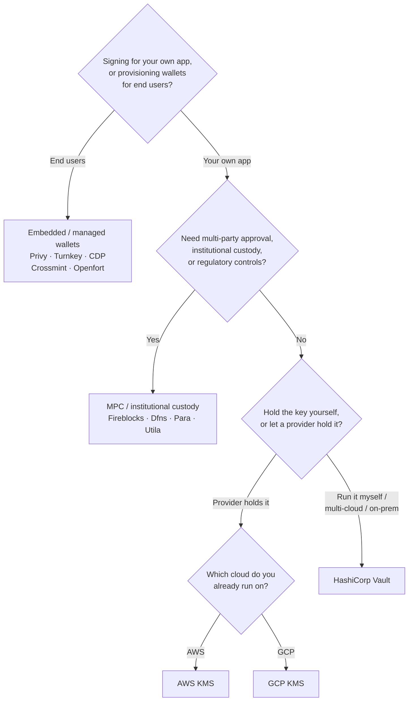

Keychain 在所有后端中提供统一的 `SolanaSigner`
接口，因此这一选择属于运营层面，而非架构层面——您可以随时通过配置进行更改。正因如此，**请从您的需求出发，而非从产品出发。**
有两个问题决定了大部分内容：_私钥存储在哪里，以及谁有权授权使用它进行签名？_

没有哪个后端是绝对最优的。每个后端都更适合特定的约束条件——您已在使用的云平台、是否愿意自行管理密钥基础设施，以及您需要满足的托管和审批控制要求。下方的流程图将这些约束条件映射到对应的后端。

<Callout type="info">
  本指南涵盖后端（服务端）签名。当您的最终用户在浏览器中自行签署 交易时，请通过
  Wallet Standard 使用钱包——
  参见[生产环境中的签名](/docs/core/transactions/signing-in-production)。
</Callout>

## 决策流程

<Callout type="info">
  本地开发和测试无需上述任何配置——原型阶段请使用 **Memory**
  后端，之后通过配置切换到上述生产后端之一。
</Callout>

## 逐步解析

<Steps>

<Step>

### 您是在为自己的应用签名，还是为最终用户签名？

如果您要为**最终用户**所拥有和操作的钱包提供服务（消费类应用、用户引导流程），请使用**嵌入式/托管钱包**后端——Privy、Turnkey、CDP、Crossmint 或 Openfort。这些服务将代您管理每位用户的钱包和身份验证。

如果您以**自己的应用程序**身份签名——费用支付方、资金库、后端自动化——请继续阅读以下内容。

</Step>

<Step>

### 您是否需要多方审批、机构托管或合规监管？

如果签名在生成之前必须通过审批策略、支出限额或合规工作流——或者您需要受监管的托管方持有密钥——请使用
**MPC
/ 机构托管**后端：Fireblocks、Dfns、Para 或 Utila。这些服务会拆分或托管密钥，并根据您的策略进行联合签名。

如果您只需要一个按需签名的密钥，请继续阅读以下内容。

</Step>

<Step>

### 您希望自己持有密钥，还是由服务提供商持有？

如果希望由云服务提供商将密钥保存在硬件支撑的基础设施中，并通过 IAM 策略控制签名权限，请使用该云平台的 KMS：

- **在 AWS 上运行** → AWS KMS
- **在 GCP 上运行** → GCP KMS

如果您希望自行管理密钥基础设施——或者您采用多云或本地部署架构——请使用 **HashiCorp
Vault**。由您自行运行和审计；密钥保留在 Transit 引擎内部，并按需签名。

</Step>

</Steps>

## 托管模式

这些后端可归纳为五种托管模式。上述流程将引导您选择其中之一。

- **自托管（进程内）**
  — 您的应用程序直接持有原始私钥。便于开发，但不适用于生产环境。后端：**Memory**。
- **自建密钥管理**
  — 由您自行运维密钥基础设施；密钥保留其中，按需签名。后端：**HashiCorp
  Vault**。
- **云 KMS / HSM**
  — 云服务提供商将密钥存储在硬件支撑的基础设施中；密钥从不离开该服务，由 IAM 策略控制签名权限。后端：**AWS
  KMS**、**GCP KMS**。
- **MPC 与机构托管**
  — 密钥由提供商拆分或托管，并根据您的策略（审批、限额）进行联合签名。后端：**Fireblocks**、**Dfns**、**Para**、**Utila**。
- **嵌入式与托管钱包**
  — 由提供商代您管理钱包，通常用于终端用户的引导注册。后端：**Privy**、**Turnkey**、**CDP**、**Crossmint**、**Openfort**。

## 后端对比

| 后端            | 托管模式             | 适用场景                      | 备注                                         |
| --------------- | -------------------- | ----------------------------- | -------------------------------------------- |
| Memory          | 自托管（进程内）     | 本地开发、测试、CI            | 密钥以明文存在于进程中——请勿在生产环境中使用 |
| HashiCorp Vault | 自托管密钥管理       | 自行维护密钥基础设施的团队    | 使用 Transit 引擎；由您自行运营和审计        |
| AWS KMS         | 云端 KMS / HSM       | 运行在 AWS 上的后端           | 密钥永不离开 KMS；IAM 控制签名权限           |
| GCP KMS         | 云端 KMS / HSM       | 运行在 GCP 上的后端           | 密钥永不离开 KMS；IAM 控制签名权限           |
| Fireblocks      | MPC / 机构级托管     | 国库、交易所、受监管托管场景  | 提供策略引擎和审批工作流                     |
| Dfns            | MPC 钱包基础设施     | 需要策略控制的程序化钱包      | Ed25519 签名                                 |
| Para            | MPC 钱包             | 需要 MPC 支持钱包的应用       | API 密钥 + 钱包 ID                           |
| Utila           | MPC 托管 + 联署方    | 已由 Utila 管理的 Solana 钱包 | `signMessage` 不支持；需自行广播交易         |
| Privy           | 嵌入式钱包           | 面向用户的消费类钱包接入应用  | 应用管理的嵌入式钱包                         |
| Turnkey         | 非托管密钥管理       | 程序化、策略门控签名          | 非托管密钥管理                               |
| CDP             | 托管钱包（Coinbase） | Coinbase 开发者平台上的应用   | `signMessage` 仅接受 UTF-8 载荷              |
| Crossmint       | 托管钱包             | 市场平台及托管钱包应用        | `smart` 和 `mpc` 钱包；`signMessage` 不支持  |
| Openfort        | 嵌入式后端钱包       | 服务端钱包场景                | 密钥存储于 TEE 中                            |

## 企业级应用场景

单个应用程序通常需要同时使用其中多个功能。由于接口完全相同，您可以在不修改调用位置的情况下，为每个角色运行不同的后端。

- **资金库操作**
  — 将日常运营的「热」签名者与「冷」资金库签名者分离。通过 MPC 托管或云端 HSM 支持资金库，并在执行高价值签名前要求审批策略。
- **审批工作流** — MPC 和托管后端（如 Fireblocks）在生成签名前执行多方审批。
- **合规与审计**
  — 云端 KMS（AWS/GCP）和 Vault 生成签名审计日志；机构托管方提供策略执行与报告功能。
- **受监管环境**
  — 将密钥材料保存在 HSM、KMS 或机构托管方中，确保原始密钥不会接触您的应用程序。

请参阅
[生产环境最佳实践](/docs/tools/keychain/production-best-practices)，了解如何安全地运行这些后端。

<Cards>
  <Card title="Rust 指南" href="/docs/tools/keychain/getting-started/rust">
    在 Rust 中配置各个后端。
  </Card>
  <Card
    title="TypeScript 指南"
    href="/docs/tools/keychain/getting-started/typescript"
  >
    在 TypeScript 中配置各个后端。
  </Card>
</Cards>
